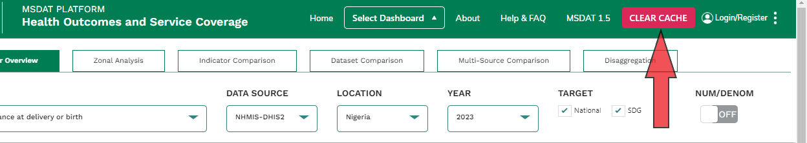
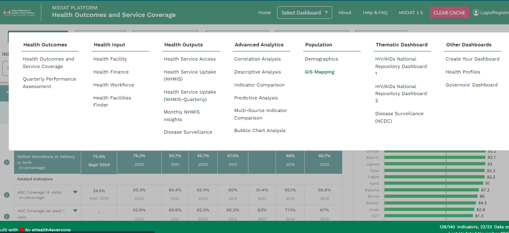
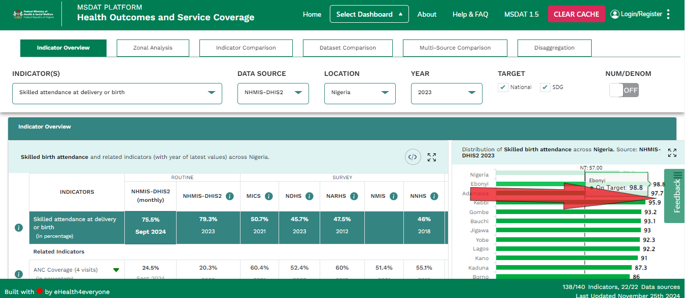
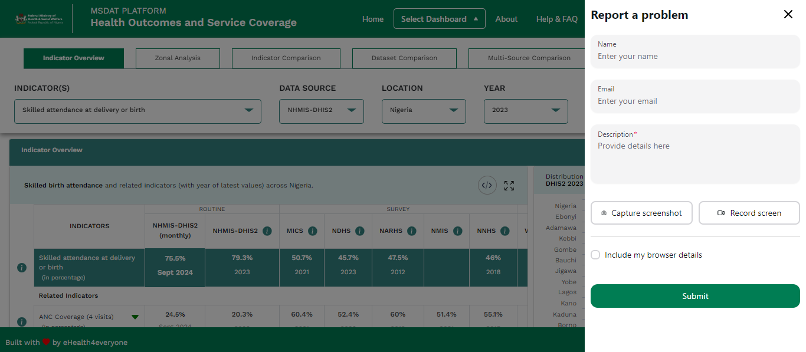

## New Functionalities and Features

### Added Functionalities

- **Added a new clear cache function to the Header**. This feature allows users to clear their cache and reset the application to its default state thereby reflecting any new change. The clear cache function is located in the header of the application and is represented by a red clear cache button. When clicked, the function clears the cache and resets the application to its default and updated state.

- **Added a new select Dashboard Panel and redesigned placement**. The select dashboard panel is an updated feature that allows users to select a dashboard from a list of available dashboards. The select dashboard panel is located at the center of the application header and is represented by a dropdown menu. When clicked, the dropdown menu displays a list of available dashboards that users can select from. The selected dashboard is then displayed on the main page of the application.

- **Added the feedback button and form feature**. The feedback button and form feature is a new addition to the application that allows users to provide feedback on the application. The feedback button is located at the center right corner of the application and is represented by a green feedback button. When clicked, the feedback button opens a feedback form where users can input their feedback and submit it. The feedback form includes fields for the user's name, email, feedback type, and feedback message.

