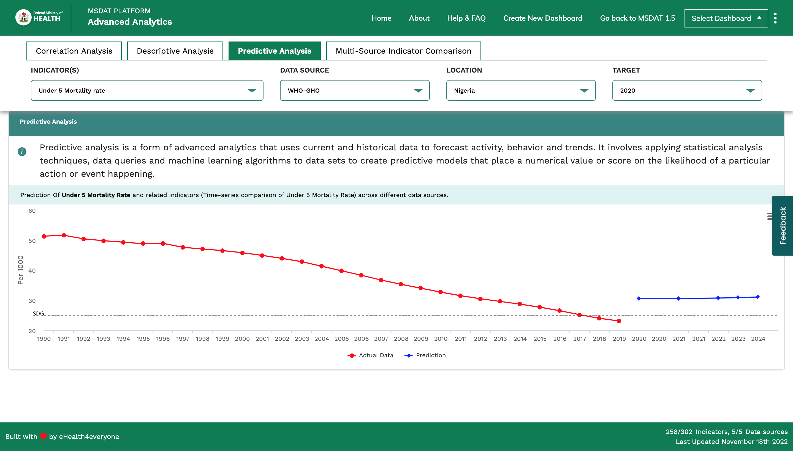
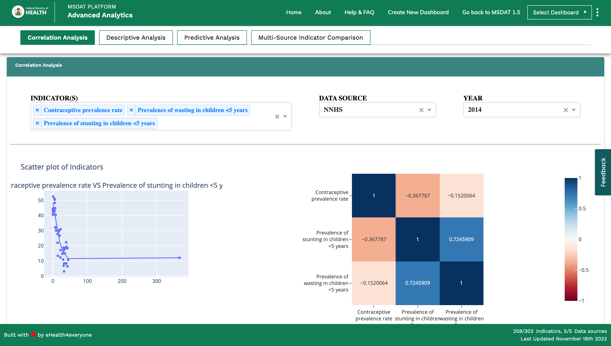
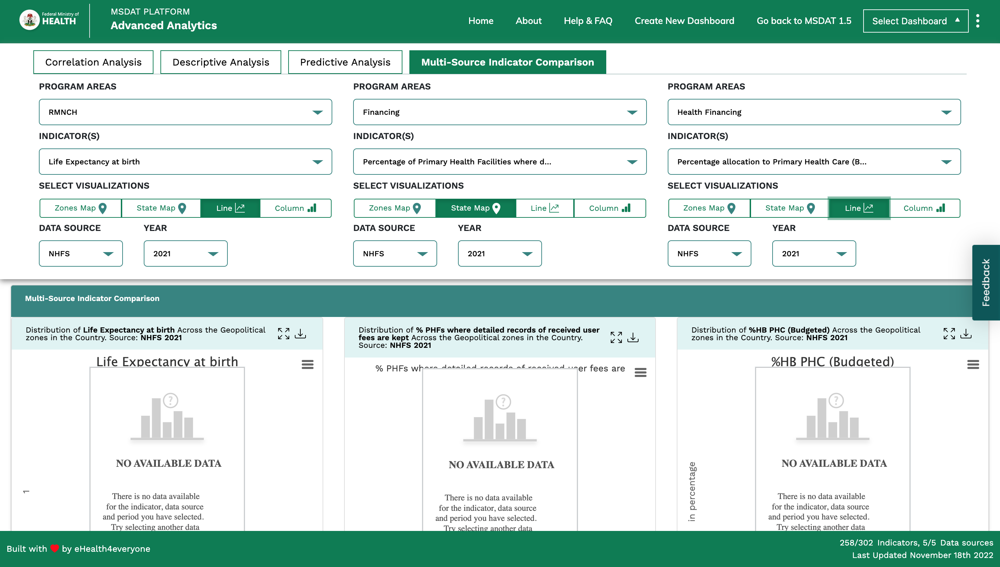
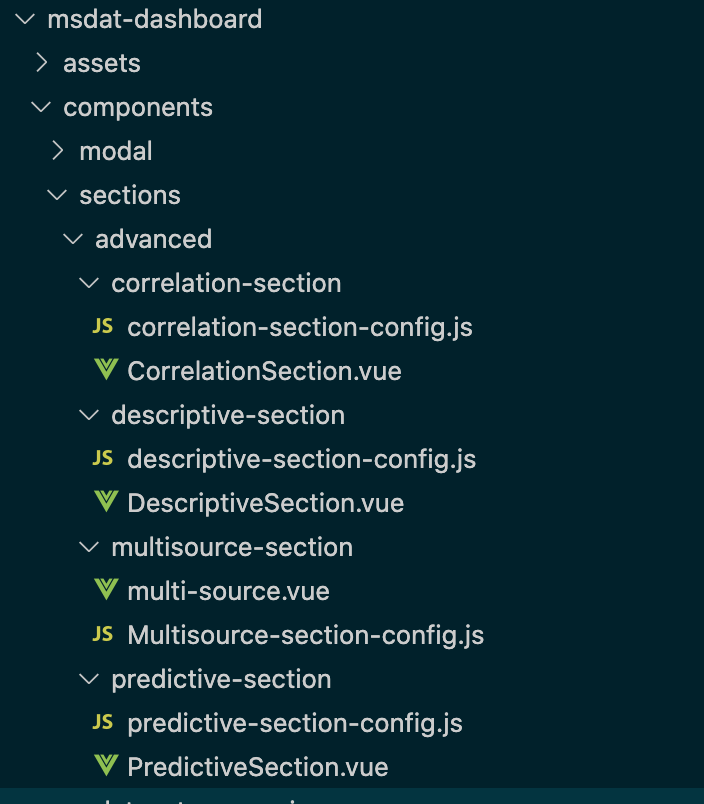

# Advanced Analytics


## Introduction

The Advanced Analytics dashboard performs autonomous or semi-autonomous examination of MSDAT data using sophisticated techniques and tools, typically beyond those of traditional business intelligence (BI), to discover deeper insights, make predictions, or generate recommendations.

## Sections

There are 5 core sections in the Advanced Analytics dashboard i.e;

1.) Predicative Analysis

2.) Correlation Analysis

3.) Multisource Indicator Comparison

4.) Descriptive Analysis

5.) Indicator Comparison


## Predictive Analysis

This section makes predictions about future outcomes using historical data combined with statistical modeling, data mining techniques and machine learning



## Correlation Analysis
This section finds out whether a relationship exists between variables and then determining the magnitude and action of that relationship. A plotly emebed was used for this section.



## Multisource Indicator Comparison
This section performs an indicator comparison across multiple program areas on the platform.




# Codebase Edits

## index.vue

 ```js
// registration process
    <AdvanceMSDAT
      v-if="Object.entries(configObject).length > 0 && isAdvanced === true && loading === false"
      :indicators="configObject.indicators"
      :dataSources="configObject.dataSources"
      :defaultIndicators="configObject.defaultIndicators"
      :initialIndicator="configObject.initialIndicator"
      :initialDataSource="configObject.initialDataSource"
      :initialLocation="configObject.initialLocation"
      :showTableRelatedIndicator="
        configObject.showTableRelatedIndicator != undefined
          ? configObject.showTableRelatedIndicator
          : true
      "
    />
 ```

  ```js
     if (name === 'Advanced_Analytics') {
      this.$store.dispatch('customDashboard', false);
      this.$store.dispatch('resetState');
      localStorage.removeItem('vuex');
      const dashboard = config.find((el) => el.name === 'Advanced_Analytics');
      if (dashboard === undefined) {
        this.$router.push('/*');
        return;
      }
      this.isAdvanced = true;
      this.configObject = '';
      this.configObject = dashboard;
      return;
    }
 ```

 ```js
export default {
  name: 'DynamicDashboard',
  components: {
    MSDAT: instance,
    AdvanceMSDAT: advanceInstance,
    ClearDBModal,
  },
  data() {
    return {
      isAdvanced: false,
 ```

## changes to basePanel.vue

 ```js

      const { name } = this.$route.params;
      if (name === 'Advanced_Analytics') {
        if (newValue === 0) {
          this.title = 'Correlation Analysis';
          this.$store.dispatch('setSectionTitle', 'Correlation Analysis');
        }
        if (newValue === 1) {
          this.title = 'Descriptive Analysis';
          this.$store.dispatch('setSectionTitle', 'Descriptive Analysis');
        }
        if (newValue === 2) {
          this.title = 'Indicator Comparison';
          this.$store.dispatch('setSectionTitle', 'Indicator Comparison');
        }
        if (newValue === 3) {
          this.title = 'Predictive Analysis';
          this.$store.dispatch('setSectionTitle', 'Predictive Analysis');
        }
        if (newValue === 4) {
          this.title = 'Multisource Inidcator Comparison';
          this.$store.dispatch('setSectionTitle', 'Multisource Inidcator Comparison');
        }
      }
 ```

  ```js
     if (name === 'Advanced_Analytics') {
      this.$store.dispatch('customDashboard', false);
      this.$store.dispatch('resetState');
      localStorage.removeItem('vuex');
      const dashboard = config.find((el) => el.name === 'Advanced_Analytics');
      if (dashboard === undefined) {
        this.$router.push('/*');
        return;
      }
      this.isAdvanced = true;
      this.configObject = '';
      this.configObject = dashboard;
      return;
    }
 ```

 ```js
export default {
  name: 'DynamicDashboard',
  components: {
    MSDAT: instance,
    AdvanceMSDAT: advanceInstance,
    ClearDBModal,
  },
  data() {
    return {
      isAdvanced: false,
 ```


# Modular Structure



## Summary

The Advanced Analytics dashboard is the sole dashboard on the MSDAT platform that has a diiferent architecture in respect to its sectional arrangement. Thus major of the changes made to the dashboard is centered on its architecture.


