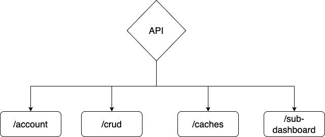

# API schema-
<!-- The SPA coonects with the backend using designated endpoints for getting specific data for the application.

 -->

### API endpoints
<!-- ## /account

#### (GET) /account/contact/

- params: page(integer)

- responses:
id(integer), email(string), profession(string), organization(string), category(string),
feedback(string), created_at(string), updated_at(string).

#### (POST) /account/contact/ 
- params: name(string), email(string), profession(string), organization(string), category(string), feedback(string), newsletter(boolean)

- responses:
name(string), email(string), profession(string), organization(string), category(string),
feedback(string), newsletter(string).

#### (GET) /account/contact/{id}
- params: id(integer)

- repsonses:
id(integer), email(string), profession(string), organization(string), category(string),
feedback(string), created_at(string), updated_at(string).

#### (PUT) /account/contact/{id}
- params: name(string), email(string), profession(string), organization(string), category(string), feedback(string), newsletter(boolean)

- responses:
name(string), email(string), profession(string), organization(string), category(string),
feedback(string), newsletter(string).

#### (PATCH) /account/contact/{id}
- params: name(string), email(string), profession(string), organization(string), category(string), feedback(string), newsletter(boolean) 

- responses:
name(string), email(string), profession(string), organization(string), category(string),
feedback(string), newsletter(string).

#### (DELETE) /account/contact/{id}
- params: id(integer)

#### (POST) /account/login
- params: emai(string), password(string)

- responses: 
is(integer), user_id(string), name(string), username(string), profession(string), organization(string), email(string), email_verified_at(string), password(string), rememmber_token(string), created_at(string), updated_at(string)

## /caches

#### (GET) /caches/data/caches/
none

#### (GET) /caches/man/refresh

none
#### (GET) /caches/man/status
none -->

## /crud

#### (GET) /crud/dashboard
- params: page(integer)

- responses: 
id(integer), name(string), created_at(string), user(integer), indicators(boolean, integer), datasources(boolean, integer)

#### (POST) /crud/dashboard
- params: name(string), user(integer), indicators(boolean, integer), datasources(boolean, integer)  ---- as an object ----

- responses:
id(integer), name(string), created_at(string), user(integer), indicators(boolean, integer), datasources(boolean, integer)

#### (GET) /crud/dashobard/{id}/
- params: id (integer)

- responses:
id(integer), name(string), created_at(string), user(integer), indicators(boolean, integer), datasources(boolean, integer)

#### (PUT) /crud/dashobard/{id}/
- params: 
1.) name(string), user(integer), indicators(boolean, integer), datasources(boolean, integer)  ---- as an object ----
2.) id (integer)

- responses:
id(integer), name(string), created_at(string), user(integer), indicators(boolean, integer), datasources(boolean, integer)

#### (PATCH) /crud/dashobard/{id}/
- params: 
1.) name(string), user(integer), indicators(boolean, integer), datasources(boolean, integer)  ---- as an object ----
2.) id (integer)

- responses:
id(integer), name(string), created_at(string), user(integer), indicators(boolean, integer), datasources(boolean, integer)

#### (DELETE) /account/contact/{id}
- params: id(integer)

#### (GET) /crud/data
- params: location(string), period(string), datasource(string), datasource_group(string), indicator(string), value_type(string),
page(integer)

- responses: id(integer), period(string), value(string), created_at(string), updated_at(string), indicator(integer), location(integer), datasource(integer), value_type(integer)

#### (POST) /crud/data
- params: ({}) - period(string), value(string), indicator(integer), location(integer), datasource(integer), value_type(integer)

- responses: id(integer), period(string), created_at(string), updated_at(string), value(string), indicator(integer), location(integer), datasource(integer), value_type(integer)

#### (GET) /crud/data/disaggregated
- params: location(string), period(string), datasource(string), datasource_group(string), indicator(string), value_type(string),
page(integer)

- responses: id(integer), period(string), value(string), created_at(string), updated_at(string), indicator(integer), location(integer), datasource(integer), value_type(integer)

#### (POST) /crud/data/disaggregated
- params: period(string), value(string), age(string), gender(string), indicator(integer), location(integer), datasource(integer), valur_type(integer)

- responses: id(integer), period(string), value(string), created_at(string), updated_at(string), indicator(integer), location(integer), datasource(integer), value_type(integer)

#### (GET) /crud/data/indicator_set
- params: location(string), period(string), datasource(string), datasource_group(string), indicator(string), value_type(string),
page(integer))

- responses: id(integer), period(string), value(string), created_at(string), updated_at(string), indicator(integer), location(integer), datasource(integer), value_type(integer)

#### (GET) /crud/data/latest
params: - location(string), period(string), datasource(string), datasource_group(string), indicator(string), value_type(string),
page(integer))

- responses: id(integer), period(string), value(string), created_at(string), updated_at(string), indicator(integer), location(integer), datasource(integer), value_type(integer)

#### (GET) /crud/data/{id}
params: id(integer)

- responses: id(integer), period(string), value(string), created_at(string), updated_at(string), indicator(integer), location(integer), datasource(integer), value_type(integer)

#### (P2UT) /crud/data/{id}
- params: 
1.) period(string), value(string), indicators(integer), location(integer), datasources(integer), value_type  ---- as an object ----
2.) id (integer)

- responses: id(integer), period(string), value(string), created_at(string), updated_at(string), indicator(integer), location(integer), datasource(integer), value_type(integer)

#### (PATCH) /crud/data/{id}
- params: 
1.) period(string), value(string), indicators(integer), location(integer), datasources(integer), value_type  ---- as an object ----
2.) id (integer)

- responses: id(integer), period(string), value(string), created_at(string), updated_at(string), indicator(integer), location(integer), datasource(integer), value_type(integer)

#### (DELETE) /crud/data/{id}
- params: 
id (integer)

#### (GET) /crud/datasource_locations/
- params: page(integer)

- responses: id(integer), created_at(string), updated_at(string), location(integer), datasource(integer)

#### (POST) /crud/datasource_locations/
- params: datasource(integer), location(integer)

- responses: id(integer), created_at(string), updated_at(string), datasource(integer), location(integer)

#### (GET) /crud/datasource_locations/{id}
- params: id(integer)

- responses: id(integer), created_at(string), updated_at(string), datasource(integer), location(integer)

#### (PUT) /crud/datasource_locations/{id}
- params: datasource(integer), location(integer)

- responses: id(integer), created_at(string), updated_at(string), datasource(integer), location(integer)

#### (PATCH) /crud/datasource_locations/{id}
- params: 1.) datasource(integer), location(integer)
2.) id(integer)

- responses: id(integer), created_at(string), updated_at(string), datasource(integer), location(integer)

#### (DELETE) /crud/datasource_locations/{id}
- params: id(integer)

#### (GET) /crud/datasource_specific_indicator
- params: page (integer)

- responses: id(integer), datasource_indicator(string), measurement_numberator(string), measurement_denominator(string), frequency(string), methodology_estimation(string), indicator_definition(string), data_level(string), national(boolean), zonal(boolean), state(boolean), senatorial(boolean), lga(boolean), created_at(string), updated_at(string), datasource(integer), indicator(integer)

#### (POST) /crud/datasource_specific_indicator
- params: datasource_indicator(string), measurement_numberator(string), measurement_denominator(string), frequency(string), methodology_estimation(string), indicator_definition(string), data_level(string), national(boolean), zonal(boolean), state(boolean), senatorial(boolean), lga(boolean), created_at(string), updated_at(string), datasource(integer), indicator(integer)

- responses: id(integer), datasource_indicator(string), measurement_numberator(string), measurement_denominator(string), frequency(string), methodology_estimation(string), indicator_definition(string), data_level(string), national(boolean), zonal(boolean), state(boolean), senatorial(boolean), lga(boolean), created_at(string), updated_at(string), datasource(integer), indicator(integer)

#### (GET) /crud/datasource_specific_indicator/{id}
- params: id(integer)

- responses: id(integer), datasource_indicator(string), measurement_numberator(string), measurement_denominator(string), frequency(string), methodology_estimation(string), indicator_definition(string), data_level(string), national(boolean), zonal(boolean), state(boolean), senatorial(boolean), lga(boolean), created_at(string), updated_at(string), datasource(integer), indicator(integer)

#### (PUT) /crud/datasource_specific_indicator/{id}
- params: 1.) datasource_indicator(string), measurement_numberator(string), measurement_denominator(string), frequency(string), methodology_estimation(string), indicator_definition(string), data_level(string), national(boolean), zonal(boolean), state(boolean), senatorial(boolean), lga(boolean), created_at(string), updated_at(string), datasource(integer), indicator(integer)

2.) id(integer)

- responses: id(integer), datasource_indicator(string), measurement_numberator(string), measurement_denominator(string), frequency(string), methodology_estimation(string), indicator_definition(string), data_level(string), national(boolean), zonal(boolean), state(boolean), senatorial(boolean), lga(boolean), created_at(string), updated_at(string), datasource(integer), indicator(integer)

#### (PATCH) /crud/datasource_specific_indicator/{id}
- params: 1.) datasource_indicator(string), measurement_numberator(string), measurement_denominator(string), frequency(string), methodology_estimation(string), indicator_definition(string), data_level(string), national(boolean), zonal(boolean), state(boolean), senatorial(boolean), lga(boolean), created_at(string), updated_at(string), datasource(integer), indicator(integer)

2.) id(integer)

- responses: id(integer), datasource_indicator(string), measurement_numberator(string), measurement_denominator(string), frequency(string), methodology_estimation(string), indicator_definition(string), data_level(string), national(boolean), zonal(boolean), state(boolean), senatorial(boolean), lga(boolean), created_at(string), updated_at(string), datasource(integer), indicator(integer)

#### (DELETE) /crud/datasource_specific_indicator/{id}

- params: id(integer)

#### (GET) /crud/datasource_valuetypes

- params: page(integer)

- responses: id(integer), created_at(string), updated_at(string), datasource(integer), valuetype(integer)

#### (POST) /crud/datasource_valuetypes

- params: datasource(integer), valuetype(integer)

- responses: id(integer), created_at(string), updated_at(string), datasource(integer), valuetype(integer)

#### (GET) /crud/datasource_valuetypes/{id}

- params: id(integer)

- responses: id(integer), created_at(string), updated_at(string), datasource(integer), valuetype(integer)

#### (PUT) /crud/datasource_valuetypes/{id}

- params: 1.) datasource(integer), valuetype(integer)  
2.) id(integer)

- responses: id(integer), created_at(string), updated_at(string), datasource(integer), valuetype(integer)

#### (PATCH) /crud/datasource_valuetypes/{id}

- params: 1.) datasource(integer), valuetype(integer)  
2.) id(integer)

- responses: id(integer), created_at(string), updated_at(string), datasource(integer), valuetype(integer)

#### (DELETE) /crud/datasource_valuetypes/{id}

- params: group(string), page(integer)

#### (GET) /crud/datasources

- params: id(integer), datasource(string), full_name(string), description(string), year_available(string), period_available(string), methodology(string), subnational_data(string), classification(string), created_at(string), updated_at(string), group(boolean, integer) 

#### (POST) /crud/datasources

- params: datasource(string), full_name(string), description(string), year_available(string), period_available(string), methodology(string), subnational_data(string), classification(string), created_at(string), updated_at(string), group(boolean, integer) 

- responses: id(integer), datasource(string), full_name(string), description(string), year_available(string), period_available(string), methodology(string), subnational_data(string), classification(string), created_at(string), updated_at(string), group(boolean, integer) 

#### (GET) /crud/datasources/{id}/

- params: id(integer)

- responses: id(integer), datasource(string), full_name(string), description(string), year_available(string), period_available(string), methodology(string), subnational_data(string), classification(string), created_at(string), updated_at(string), group(boolean, integer) 

#### (PUT) /crud/datasources/{id}/

- params: id(integer), datasource(string), full_name(string), description(string), year_available(string), period_available(string), methodology(string), subnational_data(string), classification(string), created_at(string), updated_at(string), group(boolean, integer) 

- responses: id(integer), datasource(string), full_name(string), description(string), year_available(string), period_available(string), methodology(string), subnational_data(string), classification(string), created_at(string), updated_at(string), group(boolean, integer) 

#### (PATCH) /crud/datasources/{id}/

- params: id(integer), datasource(string), full_name(string), description(string), year_available(string), period_available(string), methodology(string), subnational_data(string), classification(string), created_at(string), updated_at(string), group(boolean, integer) 

- responses: id(integer), datasource(string), full_name(string), description(string), year_available(string), period_available(string), methodology(string), subnational_data(string), classification(string), created_at(string), updated_at(string), group(boolean, integer) 

#### (DELETE) /crud/datasources/{id}/

- params: id(integer)

#### (GET) /crud/datasources/{id}/indicators/
- params: id(integer)

- responses: id(integer), datasource(string), full_name(string), description(string), year_available(string), period_available(string), methodology(string), subnational_data(string), classification(string), created_at(string), updated_at(string), group(boolean, integer) 

#### (GET) /crud/datasources/{id}/years_available/
- params: id(integer)

- responses: id(integer), datasource(string), full_name(string), description(string), year_available(string), period_available(string), methodology(string), subnational_data(string), classification(string), created_at(string), updated_at(string), group(boolean, integer) 

#### (GET) /crud/factors/
- params: id(integer)

- responses: id(integer), multiplier_factor(integer), display_factor(string), created_at(string), updated_at(string)

#### (POST) /crud/factors/
- params: multiplier_factor(integer), display_factor(string)

- responses: id(integer), multiplier_factor(integer), display_factor(string), created_at(string), updated_at(string)

#### (GET) /crud/factors/{id}/
- params: id(integer)

- responses: id(integer), multiplier_factor(integer), display_factor(string), created_at(string), updated_at(string)

#### (PUT) /crud/factors/{id}/
- params: multiplier_factor(integer), display_factor(string)

- responses: id(integer), multiplier_factor(integer), display_factor(string), created_at(string), updated_at(string)

#### (PATCH) /crud/factors/{id}/
- params: multiplier_factor(integer), display_factor(string)

- responses: id(integer), (integer), display_factor(string), created_at(string), updated_at(string)

#### (DELETE) /crud/factors/{id}/
- params: page(integer)

#### (GET) /crud/group/
- params: id(integer)

- responses: id(integer), description(string), name(string), created_at(string), updated_at(string)

#### (POST) /crud/group/
- params:  description(string), name(string)

- responses: id(integer), description(string), name(string), created_at(string), updated_at(string)

#### (GET) /crud/group/{id}/
- params: id(integer)

- responses: id(integer), description(string), name(string), created_at(string), updated_at(string)

#### (PUT) /crud/group/{id}/
- params: id(integer), description(string), name(string)

- responses: id(integer), description(string), name(string), created_at(string), updated_at(string)

#### (PATCH) /crud/group/{id}/
- params: id(integer), description(string), name(string)

- responses: id(integer), description(string), name(string), created_at(string), updated_at(string)

#### (DELETE) /crud/group/{id}/
- params: id(integer)

#### (GET) /crud/indicator_valuetypes/
- params: page(integer)

- responses: id(integer), indicator(integer), value_type(integer), created_at(string), updated_at(string)

#### (POST) /crud/indicator_valuetypes/
- params: indicator(integer), value_type(integer)

- responses: id(integer), indicator(integer), value_type(integer), created_at(string), updated_at(string)

#### (GET) /crud/indicator_valuetypes/
- params: id(integer)

- responses: id(integer), indicator(integer), value_type(integer), created_at(string), updated_at(string)

#### (PUT) /crud/indicator_valuetypes/
- params: indicator(integer), value_type(integer)

- responses: id(integer), indicator(integer), value_type(integer), created_at(string), updated_at(string)

#### (PUT) /crud/indicator_valuetypes/
- params: indicator(integer), value_type(integer)

- responses: id(integer), indicator(integer), value_type(integer), created_at(string), updated_at(string)

#### (PATCH) /crud/indicator_valuetypes/
- params: indicator(integer), value_type(integer)

- responses: id(integer), indicator(integer), value_type(integer), created_at(string), updated_at(string)

#### (DELETE) /crud/indicator_valuetypes/
- params: id(integer)

- responses: id(integer), indicator(integer), value_type(integer), created_at(string), updated_at(string)

#### (GET) /crud/indicators/
- params: group(string), page(integer)

- responses: id(integer), full_name(string), short_name(string), desirable_slope(string), indicator_type(string), program_area(string), national_target(string), national_source(string), national_information(string), sdg_target(string), sdg_information(string), first_related(integer), second_related(integer), third_related(integer), fourth_related(integer), created_at(string), updated_at(string), factor(integer), group(integer)

#### (POST) /crud/indicators/
- params: full_name(string), short_name(string), desirable_slope(string), indicator_type(string), program_area(string), national_target(string), national_source(string), national_information(string), sdg_target(string), sdg_information(string), first_related(integer), second_related(integer), third_related(integer), fourth_related(integer), created_at(string), updated_at(string), factor(integer), group(integer)

- responses: id(integer), full_name(string), short_name(string), desirable_slope(string), indicator_type(string), program_area(string), national_target(string), national_source(string), national_information(string), sdg_target(string), sdg_information(string), first_related(integer), second_related(integer), third_related(integer), fourth_related(integer), created_at(string), updated_at(string), factor(integer), group(integer)

#### (POST) /crud/indicators/
- params: full_name(string), short_name(string), desirable_slope(string), indicator_type(string), program_area(string), national_target(string), national_source(string), national_information(string), sdg_target(string), sdg_information(string), first_related(integer), second_related(integer), third_related(integer), fourth_related(integer), created_at(string), updated_at(string), factor(integer), group(integer)

- responses: id(integer), full_name(string), short_name(string), desirable_slope(string), indicator_type(string), program_area(string), national_target(string), national_source(string), national_information(string), sdg_target(string), sdg_information(string), first_related(integer), second_related(integer), third_related(integer), fourth_related(integer), created_at(string), updated_at(string), factor(integer), group(integer)

#### (GET) /crud/indicators/{id}/datasources/
- params: id(integer)

- responses: id(integer), full_name(string), short_name(string), desirable_slope(string), indicator_type(string), program_area(string), national_target(string), national_source(string), national_information(string), sdg_target(string), sdg_information(string), first_related(integer), second_related(integer), third_related(integer), fourth_related(integer), created_at(string), updated_at(string), factor(integer), group(integer)

#### (GET) /crud/indicators/{id}/years_available/
- params: id(integer)

- responses: id(integer), full_name(string), short_name(string), desirable_slope(string), indicator_type(string), program_area(string), national_target(string), national_source(string), national_information(string), sdg_target(string), sdg_information(string), first_related(integer), second_related(integer), third_related(integer), fourth_related(integer), created_at(string), updated_at(string), factor(integer), group(integer)

#### (GET) /crud/links
- params: page(integer)

- responses: id(integer), indicator(integer), datasource(integer), link(string), created_at(string), updated_at(string), period(string)

#### (POST) /crud/links
- params: period(string), indicator(integer), datasource(integer), link(string),

- responses: id(integer), indicator(integer), datasource(integer), link(string), created_at(string), updated_at(string), period(string)

#### (GET) /crud/links/{id}
- params: id(integer)

- responses: id(integer), indicator(integer), datasource(integer), link(string), created_at(string), updated_at(string), period(string)

#### (PUT) /crud/links/{id}
- params: id(integer), period(string), indicator(integer), datasource(integer), link(string),

- responses: id(integer), indicator(integer), datasource(integer), link(string), created_at(string), updated_at(string), period(string)

#### (PUT) /crud/links/{id}
- params: id(integer), period(string), indicator(integer), datasource(integer), link(string),

- responses: id(integer), indicator(integer), datasource(integer), link(string), created_at(string), updated_at(string), period(string)

#### (PATCH) /crud/links/{id}
- params: id(integer), period(string), indicator(integer), datasource(integer), link(string),

- responses: id(integer), indicator(integer), datasource(integer), link(string), created_at(string), updated_at(string), period(string)

#### (DELETE) /crud/links/{id}
- params: id(integer)

#### (GET) /crud/location
- params: page(number)

- responses: id(integer), name(string), parent(integer), level(integer), created_at(string), updated_at(string)

#### (POST) /crud/location
- params: name(string), parent(integer), level(integer)

- responses: id(integer), name(string), parent(integer), level(integer), created_at(string), updated_at(string)

#### (GET) /crud/location/{id}
- params: id(integer)

- responses: id(integer), name(string), parent(integer), level(integer), created_at(string), updated_at(string)

#### (PUT) /crud/location/{id}
- params: name(string), parent(integer), level(integer), id(integer)

- responses: id(integer), name(string), parent(integer), level(integer), created_at(string), updated_at(string)

#### (PATCH) /crud/location/{id}
- params: name(string), parent(integer), level(integer), id(integer)

- responses: id(integer), name(string), parent(integer), level(integer), created_at(string), updated_at(string)

#### (DELETE) /crud/location/{id}
- params: id(integer)

#### (GET) /crud​/location_hierarchy_level​
- params: page(integer)

- responses: id(integer), name(string), created_at(string), updated_at(string)

#### (POST) /crud​/location_hierarchy_level​
- params: name(string)

- responses: id(integer), name(string), created_at(string), updated_at(string)

#### (POST) /crud​/location_hierarchy_level​
- params: name(string)

- responses: id(integer), name(string), created_at(string), updated_at(string)

#### (GET) /crud/location_hierarchy_level/{id}/
- params: id(integer)

- responses: id(integer), name(string), created_at(string), updated_at(string)

#### (PUT) /crud/location_hierarchy_level/{id}/
- params: name(string), id(integer)

- responses: id(integer), name(string), created_at(string), updated_at(string)

#### (PATCH) /crud/location_hierarchy_level/{id}/
- params: name(string), id(integer)

- responses: id(integer), name(string), created_at(string), updated_at(string)

#### (DELETE) /crud/location_hierarchy_level/{id}/
- params: id(integer)

- responses: id(integer), name(string), created_at(string), updated_at(string)

#### (GET) /crud/subscriber/
- params: page(integer)

- responses: id(integer), name(string), email(string)

#### (POST) /crud/subscriber
- params: name(string), email(string)

- responses: id(integer), name(string), email(string)

#### (GET) /crud/subscriber/{id}/
- params: id(integer)

- responses: id(integer), name(string), email(string)

#### (PUT) /crud/subscriber/{id}/
- params: name(string), email(string), id(integer)

- responses: id(integer), name(string), email(string)

#### (PATCH) /crud/subscriber/{id}/
- params: name(string), email(string), id(integer)

- responses: id(integer), name(string), email(string)

#### (DELETE) /crud/subscriber/{id}/
- params: id(integer)

#### (GET) /crud/user
- params: page(integer)

- responses: first_name(string), last_name(string), username(string), email(string), password(string)

#### (POST) /crud/user
- params: first_name(string), last_name(string), username(string), email(string), password(string)

- responses: first_name(string), last_name(string), username(string), email(string), password(string)

#### (GET) /crud/user/{id}
- params: id(integer)

- responses: first_name(string), last_name(string), username(string), email(string), password(string)

#### (PUT) /crud/user/{id}
- params: id(integer), first_name(string), last_name(string), username(string), email(string), password(string)

- responses: first_name(string), last_name(string), username(string), email(string), password(string)

#### (PATCH) /crud/user/{id}
- params: id(integer), first_name(string), last_name(string), username(string), email(string), password(string)

- responses: first_name(string), last_name(string), username(string), email(string), password(string)

#### (DELETE) /crud/user/{id}
- params: id(integer)

#### (POST) /crud/valuetypes/
- params: value_type(string)

- responses: id(integer), value_type(string), created_at(string), updated_at(string)

#### (GET) /crud/valuetypes/
- params: id(integer)

- responses: id(integer), value_type(string), created_at(string), updated_at(string)

#### (PUT) /crud/valuetypes/{id}
- params: value_type(string), id(integer)

- responses: id(integer), value_type(string), created_at(string), updated_at(string)

#### (PATCH) /crud/valuetypes/{id}
- params: value_type(string), id(integer)

- responses: id(integer), value_type(string), created_at(string), updated_at(string)

#### (DELETE) /crud/valuetypes/{id}
- params: id(integer)
<!-- 

## /subdashboard -->
<!-- 
#### (POST) /subdashboard/interest/
- params: email(string), dashboard(string), created(string)

- responses: id(integer),  email(string), dashboard(string), created(string), created_at, updated_at

#### (DELETE) /subdashboard/interest/(email)
- params: email(string)

#### (GET) /subdashboard/interests/
- responses: id(integer),  email(string), dashboard(string), created(string), created_at, updated_at

#### (GET) /subdashboard/interests/{email}/
- params: email(string)

- responses: id(integer),  email(string), dashboard(string), created(string), created_at, updated_at -->