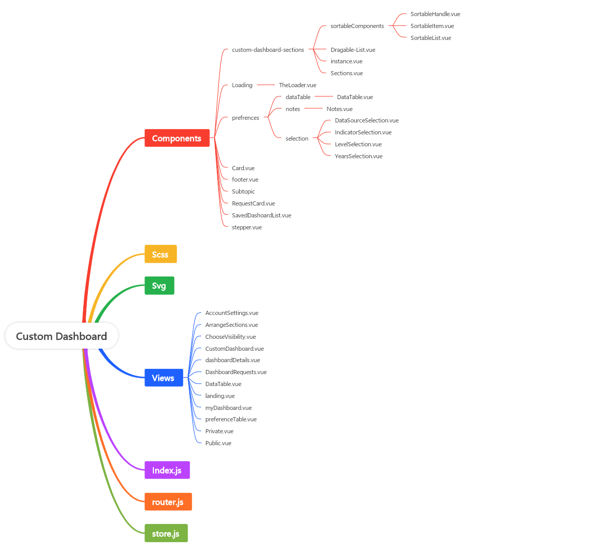

# Custom Dashboard


## Introduction

MSDAT custom dashboard helps you to set up your custom dashboard to suit your needs. The dashboard comes with cleaned data on the certain key health indicators in Nigeria. This data can be made available for your use. The platform allows for sectioning of your charts. So you can section your visualizations into any section of your choice, giving you control over your data and making it easier to analyse. [Link to the ui mockup ](https://xd.adobe.com/view/43ace9e3-1c9b-4cb2-9e8c-0c8228dd709d-16ff/specs/)

## Hierachy of folders


### Some Key functions

This function in the dynamic dashboard folder of the MSDAT modules helps us push selected data into the msdat platform config array.

```js  
    if (this.$store.state.CUSTOM_DASHBOARD_STORE.customDashboard === true) {
      this.isCustom = true;
      // FOR Indicators
      const ids = [];
      const sourcesID = [];
      this.$store.getters.getprogramArea.map((element) => {
        if (element.parent.isChildSelected === true) {
          element.children.map((child) => {
            if (child.selected === true) {
              ids.push(child.id);
            }
            return child;
          });
        }
        return element;
      });

      // For DataSources
      this.$store.getters.getDataSource.map((element) => {
        element.children.map((child) => {
          if (child.selected === true) {
            sourcesID.push(child.id);
          }
          return child;
        });
        return element;
      });
      this.dashboardConfig.push({
        name: this.$store.state.CUSTOM_DASHBOARD_STORE.dashboardDetails.name
          .replace(/\s+/g, '_')
          .toLowerCase(),
        title: this.$store.state.CUSTOM_DASHBOARD_STORE.dashboardDetails.name
          .replace(/\s+/g, '_')
          .toLowerCase(),
        indicators: ids,
        defaultIndicators: [7, 6, 5],
        dataSources: sourcesID,
        initialIndicator: ids[0],
        initialDataSource: sourcesID[0],
        initialLocation: 1,
      });

      this.configObject = this.dashboardConfig.find(
        (item) => item.name === name,
      );
    }
```

#### Store.js:

This action sets the indicator coming from the api

```js
  async loadIndicators({ commit, state, dispatch }) {
    let loading = true;
    if (state.masterData.length === 0) {
      loading = true;
      commit('setIndiLoading', loading);
      await axios.get('https://msdat-api.fmohconnect.gov.ng/api/indicators/')
        .then((res) => {
          const data = res.data.results;
          const array = data.map((pArea) => pArea.program_area);
          const distinctArray = [...new Set(array)];
          const composedData = [];

          distinctArray.forEach(((distItem) => {
            if (state.allSelected === false) {
              composedData.push({
                children: data.filter(
                  (x) => {
                    if (x.program_area === distItem) {
                      x.selected = false;
                      x.sources = [];
                      x.years = [];
                      x.levels = [];
                      return x;
                    }
                    if (state.allSelected === true) {
                      x.selected = true;
                    }
                  },
                ),
                parent: { selected: false, isChildSelected: false, value: distItem.toUpperCase() },
                showList: false,
                showNotes: false,

              });
            } else {
              composedData.push({
                children: data.filter(
                  (x) => {
                    if (x.program_area === distItem) {
                      x.selected = true;
                      x.sources = [];
                      x.years = [];
                      x.levels = [];
                      return x;
                    }
                  },
                ),
                parent: { selected: true, isChildSelected: true, value: distItem.toUpperCase() },
                showList: true,
                showNotes: true,
              });
            }
          }));
          loading = false;
          commit('setIndiLoading', loading);
          commit('setPArea', composedData);
          if (state.allSelected === true) {
            composedData.map((x) => {
              x.children.forEach((child) => {
                const childs = {
                  id: child.id,
                };
                dispatch('loadCoverageLevels', childs);
                dispatch('loadYears', childs);
              });
            });
          }
        }).catch((err) => {
          console.log(err);
          loading = true;
          commit('setIndiLoading', loading);
        });
    }
  },
```

This action loads the datasources for the first time

```js
  // Load DataSources From API for the First time.
  async loadDataSource({ commit, state }) {
    if (state.SurveyArray.length === 0) {
      let loading = true;
      commit('setDSLoading', loading);
      await axios.get('https://msdat-api.fmohconnect.gov.ng/api/datasources/')
        .then((res) => {
          // const { data } = res;
          const data = res.data.results;
          const array = data.map((dArea) => dArea.classification);

          const distinctDataArray = [...new Set(array)];
          const SurveyArray = [];

          distinctDataArray.forEach(((distItem) => {
            if (state.allSelected === false) {
              SurveyArray.push({
                children: data.filter(
                  (x) => {
                    if (x.classification === distItem) {
                      x.selected = false;
                      return x;
                    }
                  },
                ),
                parent: distItem?.toUpperCase(),

              });
            } else {
              SurveyArray.push({
                children: data.filter(
                  (x) => {
                    if (x.classification === distItem) {
                      x.selected = true;
                      return x;
                    }
                  },
                ),
                parent: distItem.toUpperCase(),
              });
            }
            SurveyArray.sort((a, b) => {
              const keyA = a.parent;
              if (keyA === 'ROUTINE') return -1;
              return 0;
            });
          }));
          loading = false;
          commit('setDSLoading', loading);
          commit('setDArea', SurveyArray);
        }).catch((err) => {
          // eslint-disable-next-line no-unused-expressions
          console.log(err);
          loading = false;
          commit('setDSLoading', loading);
        });
    }
  },
```


This action loads the dtasources for the first time


```js
  async loadYears({ commit, state }, payload) {
    let dataObj = {};
    let loading = true;
    if (payload.checked === true || state.allSelected === true) {
      loading = true;
      commit('setYearsLoading', loading);
      await axios.get(`https://msdat-api.fmohconnect.gov.ng/api/indicators/${payload.id}/years_available/`)
        .then((res) => {
          const { data } = res;
          if (state.allSelected === false) {
            const yearsData = data.years.map((year) => ({ selected: false, value: year }));
            dataObj = {
              id: payload.id, childName: payload.child, years: yearsData, parentName: payload.parent, checked: payload.checked,
            };
          } else {
            const yearsData = data.years.map((year) => ({ selected: true, value: year }));
            dataObj = {
              id: payload.id, childName: payload.child, years: yearsData, parentName: payload.parent, checked: payload.checked,
            };
          }
          loading = false;
          commit('setYearsLoading', loading);
        });
    } else {
      dataObj = {
        id: payload.id, childName: payload.child, years: [], parentName: payload.parent, checked: payload.checked,
      };
    }
    loading = false;
    commit('setYearsLoading', loading);
    commit('getYears', dataObj);
  },
```


The Custom Dashboard routing in the router.js file

```js
import VueCookies from 'vue-cookies';

export default [
  {
    path: '/custom',
    name: 'custom-dashboard',
    component: () => import('./views/landing.vue'),
  },
  {
    path: '/custom/login',
    name: 'custom-dashboard-login',
    component: () => import('../auth/views/login.vue'),
  },
  {
    path: '/my-dashboard',
    name: 'my-dashboard',
    beforeEnter: (to, from, next) => {
      const token = VueCookies.get('msdat-access-token');
      if (!token) {
        next('/custom/login');
      } else {
        return next();
      }
      return null;
    },
    component: () => import('./views/myDashboard.vue'),
    children: [
      // Page 1
      {
        path: 'details',
        name: 'my-dashboard-details',
        component: () => import('./views/dashboardDetails.vue'),
      },
      // Page 2
      {
        path: 'preference-table',
        name: 'preference-table',
        component: () => import('./views/preferenceTable.vue'),
      },
      // Page 3
      {
        path: 'data-table',
        name: 'data-table',
        component: () => import('./views/DataTable.vue'),
      },
      // Page 3
      {
        path: 'sections',
        name: 'sections',
        component: () => import('./views/ArrangeSections.vue'),
      },
    ],
  },
];

```


