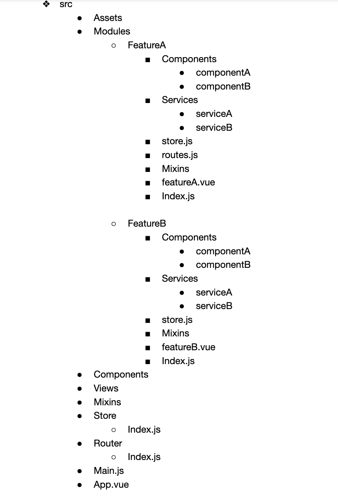

# Modular Structure

## Overview

This guide lays down the description of the MSDAT project from a developers standpoint. The MSDAT platform is a fullstack application that was built using VueJs, Postgress, Express, .... as the core technologies.During the development process, a modular approach was adopted following the 'folder-by-feature' file structure. As shown in detail in the diagram below.

Following the best practices in developing a VueJs application. Most of what is seen the dash board.
For example, in the indicator overview section, there are 3 components as seen in the diagram below.

## File structure/ Modular approach

As descibed earlier, a modular approach was adopted. Project was created using the vue CLI. Below shall give in more detail the folders and their uses present in the code base.
// add picture here of a screenshot of the folders showing in vs code.

## Folders

#### src folder
These will be folders/files created with Vue CLI. In addition to these, the main source code for the application(main components, main views, store, router etc) will reside here.

#### router
This file will be responsible for combining all the route configuration from feature modules. 

#### store
All the state management related configuration will be done in this file. For eg. Vuex related configuration will be done here. All the states from the different feature modules will be combined here and will be configured with the state management system.

#### Main.js
This file is responsible for bootstrapping the Vue application.
####  assets
Houses all images, and related assets of the project.
#### components
Some of the components have an index.js file in the folder. This exports whatever is in the folder globally. It is made global when it is imported in the root index.js file.
#### config
#### modules
####  plugins
Most of the plugins are in the plugins folder. Plugins such as axios.js, dexie.js, highchart.js, etc. are to be accessed globally.
#### router

#### scss
#### store
This is vuex store directory for all vuex related files.
#### util
Holds plugin configurations, Global component registration function and filters.
#### views
Where all the .vue pages are housed.

## Files
#### App.vue
This is the root component which will contain the main view of the application.

#### .env
The configuration text file that is used to define variables to be passed into the applications environment. Common used for API_BASE_URL variables.
#### .env.local
Same function as the .env file, but not being tracked by Git.
#### .eslintrc.js
Configuration file for identifying and reporting on patterns found in ECMAScript/JavaScript code. This makes the code more consistent and avoid bugs.
#### .gitlab-ci.yml
Defines the project's Pipelines, Jobs, and Environments.
#### .prettierrc
configuration file used by Prettier to automate code formatting.
#### cypress.Json
#### jest.config.js
This is used for configuring Jest which is the JavaScript testing library used for writing unit and integration tests.
#### package.json
Records important metadata about a project.
#### readme.md
#### vue.config.js
config file for the vue project

## Hierachy of folders
display a chart diagram here

## Modules
display a chart diagram here

## API schema
display a chart diagram 
### API endpoints

### /account

#### (GET) /account/contact/
Description: to get the user.

id(integer), email(string), profession(string), organization(string), category(string),
feedback(string), created_at(string), updated_at(string).

#### (POST) /account/contact/ 
Description: to get the user.

name(string), email(string), profession(string), organization(string), category(string),
feedback(string), newsletter(string).

#### (GET) /account/contact/{id}
id(integer), email(string), profession(string), organization(string), category(string),
feedback(string), created_at(string), updated_at(string).

#### (PUT) /account/contact/{id}
name(string), email(string), profession(string), organization(string), category(string),
feedback(string), newsletter(string).

#### (PATCH) /account/contact/{id}

name(string), email(string), profession(string), organization(string), category(string),
feedback(string), newsletter(string).

#### (DELETE) /account/contact/{id}
id(integer)

#### (POST) /account/login
email(string), password(string)

### /caches

#### (GET) /caches/data/caches/
none

#### (GET) /caches/man/refresh

none
#### (GET) /caches/man/status
none

### /crud

#### (GET) /caches/data/caches/
id, name, created_at, user, indicators

#### (GET) /caches/man/refresh

#### (GET) /caches/man/status

#### (PUT) /account/contact/{id}

#### (PATCH) /account/contact/{id}

#### (DELETE) /account/contact/{id}

#### (POST) /account/login

### API e

### API endpoints

### API endpoints

### API endpoints

## IndexedDB Schema
display a chart diagram here

## Data layer feature/ implementation
display a chart diagram here

