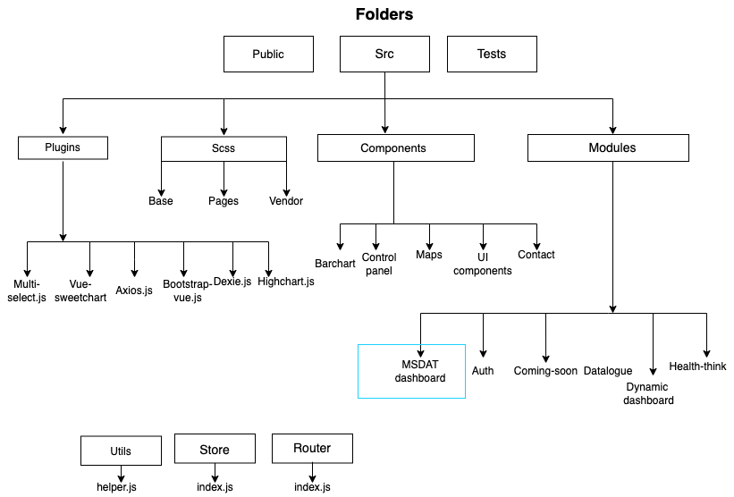
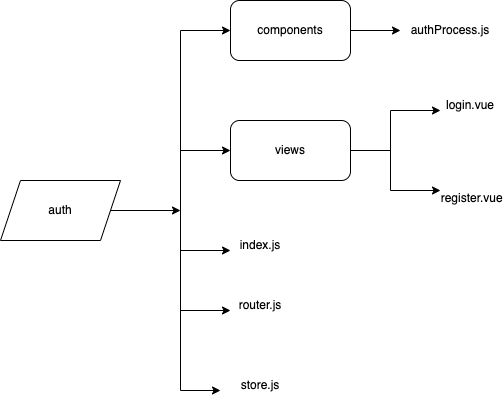
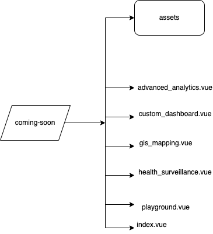
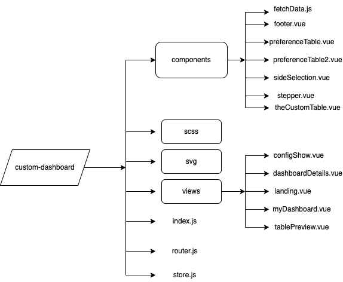
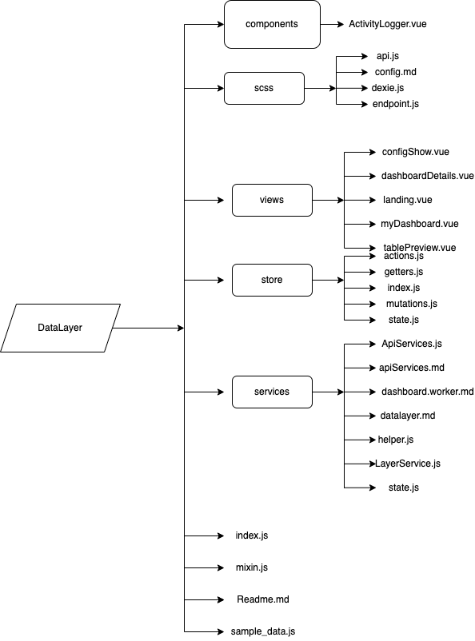
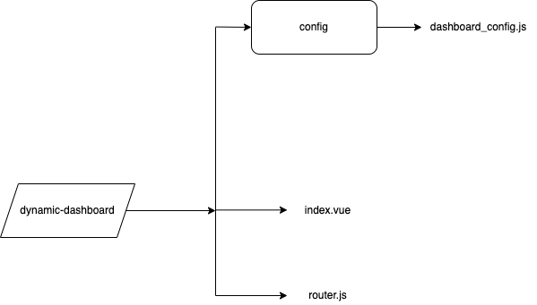
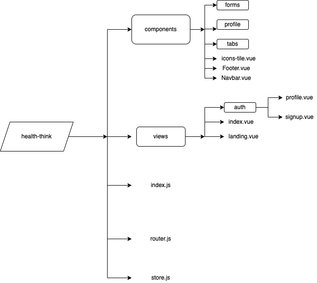
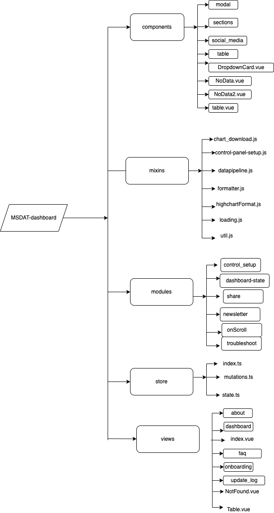
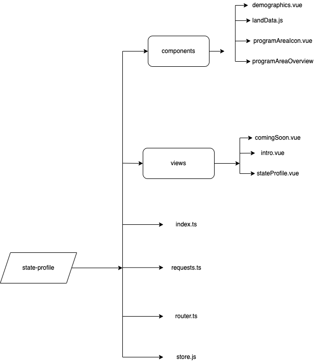

# Modular Structure

## Overview

This guide lays down the description of the MSDAT project from a developers standpoint. The MSDAT platform is an SPA built with VueJs as the frontend framework. During the development process, a modular approach was adopted following the 'folder-by-feature' file structure.


## File structure/ Modular approach


###  Practical Example
An authentication module on a main application:

As explained all files concerning this feature will be contained in a single folder named “authentication”  which will in turn contain the following;
Components (folder)
Services.js (file)
Index.js (file)
Store.js (file)

#### Components: 
	Individual components that will handle different phases of the authentication feature;
Login.vue
Logout.vue
Signup.vue


#### Sevices.js:
	Definition of Api requests and functions specific to individual phases of authentication, easily reusable within the the authentication module

 A simple registration/signup function can look like this;
 ```js
// registration process
const regRoutine = (user) =>
 new Promise((resolve, reject) => {
   axios({ url: regUrl, data: user, method: "POST" })
     .then((response) => {
       resolve(response);
     })
     .catch((error) => {
       reject(error);
     });
 });
 ```

And a simple login function can look like this;
 ```js
// login process
const loginRoutine = (user) =>
 new Promise((resolve, reject) => {
   axios({ url: loginUrl, data: user, method: "POST" })
     .then((response) => {
       const accessToken = response.data.access_token;
       const refreshToken = response.data.refresh_token;
       VueCookies.set("access-token", accessToken); // store the token in cookie
       VueCookies.set("refresh-token", refreshToken); // store the token in cookie
 
       store.dispatch("setAuthStatus", "success");
       resolve(response);
     })
     .catch((error) => {
       VueCookies.remove("access-token"); // if the request fails, remove any possible user token
       VueCookies.remove("refresh-token"); // if the request fails, remove any possible user token
       reject(error);
     });
 });
 ```

Functions like this along with similar functions (logoutRoutine, loginRoutine, passwordResetRoutine, etc.) will make up the services.js file

#### Index.js:
	Bootstrapping for the authentication module; initialization and customization of packages specific to the authentication module.

 ```js
import Vuelidate from 'vuelidate'
import VueCookies from 'vue-cookies'
 
Vue.use(Vuelidate)
Vue.use(VueCookies);
  ```


#### Store.js:

	Handles  state management for the entire authentication module (state, actions, mutations, etc.)

All mentioned files and folders that make up the authentication module will be imported and interfaced into the main application where necessary.


## Hierachy of folders



## Root Folders
- src:
Stores files/ folders with the primary purpose of reading or editing the code.

- router:
Combines all route configuration from feature modules. 

- store:
Managing state management (vuex) configuration.

- assets:
Houses all images, and related assets of the project.

- components
Stores components' folders used for the application

- modules:
Store folder for the MSDAT application features.

- plugins:
Most of the plugins are in the plugins folder. Plugins such as axios.js, dexie.js, highchart.js, etc. are to be accessed globally.

- router:
Entry folder for application routing

- scss:
Entry folder for scss files

- store:
This is vuex store directory for all vuex related files.

- util:
Holds plugin configurations, Global component registration function and filters.

- views:
Where all the .vue pages are housed.


## Root Files

- App.vue:
This is the root component which will contain the main view of the application.

- main.js:
Entry Javascript file for the project

- .env:
The configuration text file that is used to define variables to be passed into the applications environment. Common used for API_BASE_URL variables.

- .env.local:
Same function as the .env file, but not being tracked by Git.

- .eslintrc.js:
Configuration file for identifying and reporting on patterns found in ECMAScript/JavaScript code. This makes the code more consistent and avoid bugs.

- .gitlab-ci.yml:
Defines the project's Pipelines, Jobs, and Environments.

- .prettierrc:
configuration file used by Prettier to automate code formatting.

- jest.config.js:
This is used for configuring Jest which is the JavaScript testing library used for writing unit and integration tests.

- package.json:
Records important metadata about a project.

- readme.md:
Readme documentation file.

- vue.config.js:
config file for the vue project.


# Modules
Detialed overview of the Modules folder used for the MSDAT application. Each feature in the MSDAT application is represented as a module.

## auth


## coming-soon



## custom-dashboard


## data-layer


## Dynamic_dashboard


## health-think


## MSDAT-dashboard


## state-profile



<!-- ## Modules
display a chart diagram here -->

<!-- 
## IndexedDB Schema
display a chart diagram here

## Data layer feature/ implementation
display a chart diagram here -->


