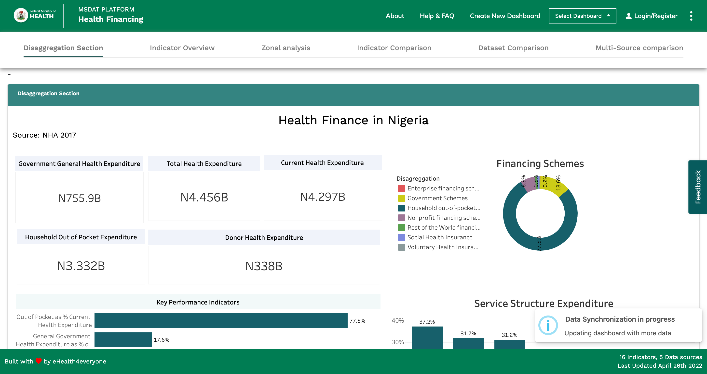
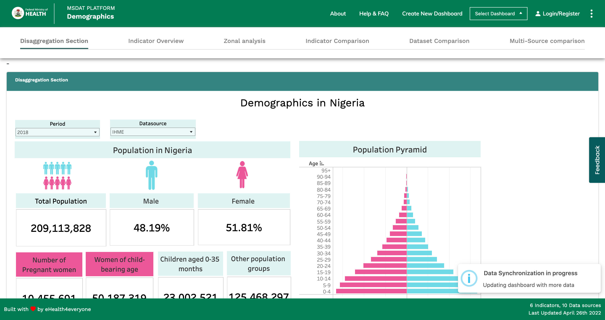

# Disaggregation Section

## Introduction
A new section (disaggregation) was added to the main application page spaning all sub dashboards (i.e; Health WorkForce, Demographics, Health Financing, etc). When displayed, it loads the respective tableau dashboard for the respective sub dashboard.
###  Desktop
Pictorial representation of the disaggregation section on the Health Finance dashboard.

Pictorial representation of the disaggregation section on the Demographics dashboard.

## Code base
In the Code base, 4 main files were edited to effect the change.
- Instance.vue
- DynamicSection.vue
- dynamic-section-config.js
- BasePanel.vue

For a detailed explanation of the changes made to the code base, kindly view the video documentation listed below:
https://drive.google.com/file/d/1F8k8Ns_XmDd2EZt1waNcuTSfh68hUDNS/view?usp=sharing

