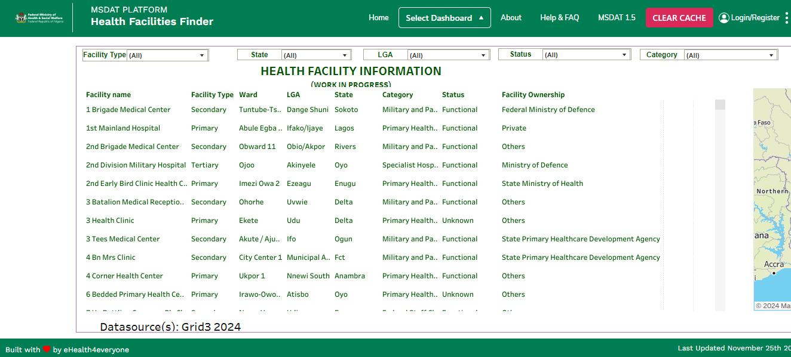

# Health Facility Finder Dashboard

## Introduction

The Health Facility Finder Dashboard is a tool for looking up health facilities in a given area. It groups health facilities by type and provides information on the services they offer. The dashboard is designed to be user-friendly and functional, allowing users to easily find the information they need. 

## Desktop

pictoral respresetation of the desktop view of the Health Facility Finder Dashboard

## Code base

This dashboard was built using Tableau and the it was directly embedded into the main application page. 