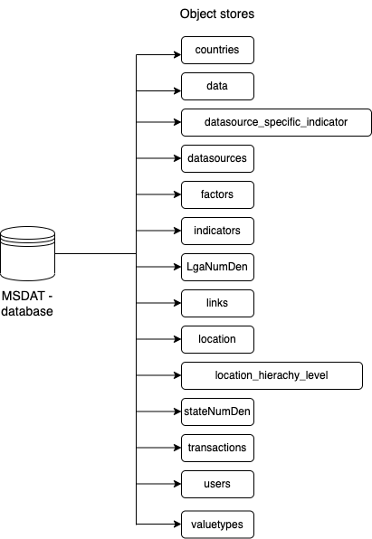

# Index-db Schema

## intoduction

IndexDB was adopted as a method for users to persistently store data inside their browser. IndexDB achieves this by providing rich query abilities regardless of network availability, enabling the MSDAT application to work both online and offline.


## Dexis.js:
In the application development, Dexie.js was used as a minimalistic library for the indexDB implementation.

When the application is started on a database, the following code lines creates a new indexDB database and its respective object stores.
```js
const db = new Dexie('msdat-database3');

db.version(1).stores({
```

Schema of IndexDB:



## object stores

#### countries
- key: id
- other fields: country

#### data
- key: id
- other fields: [indicator + period], [value + period + indicator + datasource + value_type], value, indicator, datasource, value_type, [indicator + datasource], location

#### datasource_specific_indicator
- key: id
- other fields: state, measurement_numerator, zonal, data_level, datasource_indicator, measurement_denominator, frequency, lga, methology_estimation, datasource, indicator, senatorial, national, indicator_denominator

#### datasources
- key: id
- other fields: updated_at, full_name, created_at, subnational_data, datasource, description, year_available, period_available, classification, methodology

#### factors
- key: id
- other fields: multiplier_factor, display_factor

#### indicators
- key: id
- other fields: sdg_information, short_name, third_related, created_at, national_source, desirable_slope, indicator_type, program_area, fourth-related, updated_at, national_target, factor, sdg_target, first_related, full_name, second_related, national_information.

#### LgaNumDen
- key: id

#### links
- key: id
- other fields: created_at, period, link, updated_at, datasource, indicator

#### location
- key: id
- other fields: level, name, parent

#### location_hierachy_level
- key: id
- other fields: name

#### sub_dashboard_interests
- key: id
- other fields: created, email, dashboard

#### transactions
- key: id

#### users
- key: id
- other fields: email, userid, name, profession, organization, password, username

#### valuetypes
- key: id
- other fields: value_type


# indexed DB service

The Indexed DB services has a list of methods that interact with the  indexed DB dashboard
more importantly to note the services runs on a web worker.
using the **comlink-loader** package installed. files in the dashboard ending with **.worker.js** are ran on a separate thread outside the main 

please also take time to Learn web Worker and it limitation for better clarity 

Usage
-----

```js
import DB from "form/the/location/of/the/file/dashboard.worker";
```
Installation
------------
```js
const db = new DB();
```

Methods
------------

### constructor()
The constructor method initialize the index the instance and config .


### checkIndicatorsInIdb()
The constructor method initialize the index the instance and config .

**Example**
```js
let value = await db.chcheckIndicatorsInIdb();
```

**Return value**
An array of all the indicator ID in the IndexedDB


### storeDataInDBTable(data,tableName)
The method stores the data into the indexed DB .

**Example**
```js
let value = await db.storeDataInDBTable(data,tableName);
```

**Parameters**

- `data: array`<br/>
  An array of data object to be stored in the indexed DB database.

- `tableName: string`<br/>
  The name of the database table to to store the data


### storeDataInDB(data)
The method stores the data into the indexed DB  data Table.

**Example**
```js
let value = await db.storeDataInDB(data);
```

**Parameters**

- `data: array`<br/>
  An array of data object to be stored in the indexed DB database.


### storeDataInDB(data)
The method stores the data into the indexed DB  data Table.

**Example**
```js
let value = await db.storeDataInDB(data);
```

**Parameters**

- `data: array`<br/>
  An array of data object to be stored in the indexed DB database.


### initData(indicators)
The Method checks if the exist in the indexed db if not fetches it from the API using the API services


**Example**
```js
let value = await db.initData(indicators);
```

**Parameters**

- `indicators: array`<br/>
  An array of indicator ID's to perform the operation on  .


### queryDB(query = {})
This method is a static method tha return and array of 


**Example**
```js
let value = await DB.queryDB({indicator:5,dashboard:8,period:"2015"});
```

**Parameters**

- `query: object`<br/>
   object for the what need to be queried


**Return value**
An array data object request by the query


