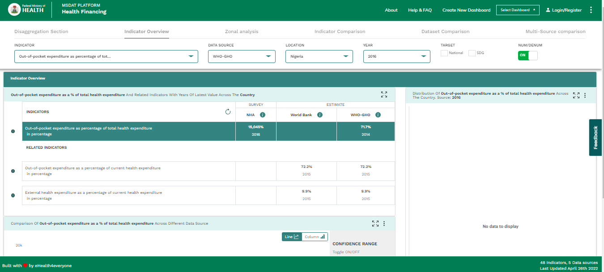
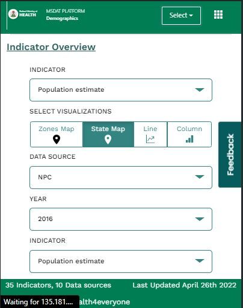
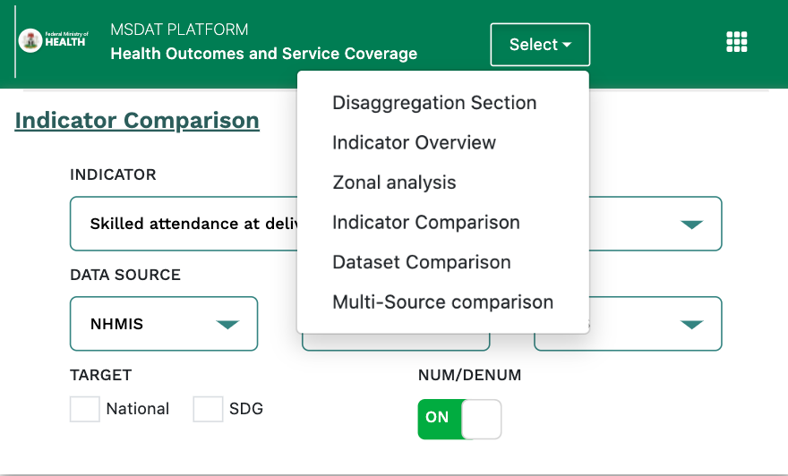
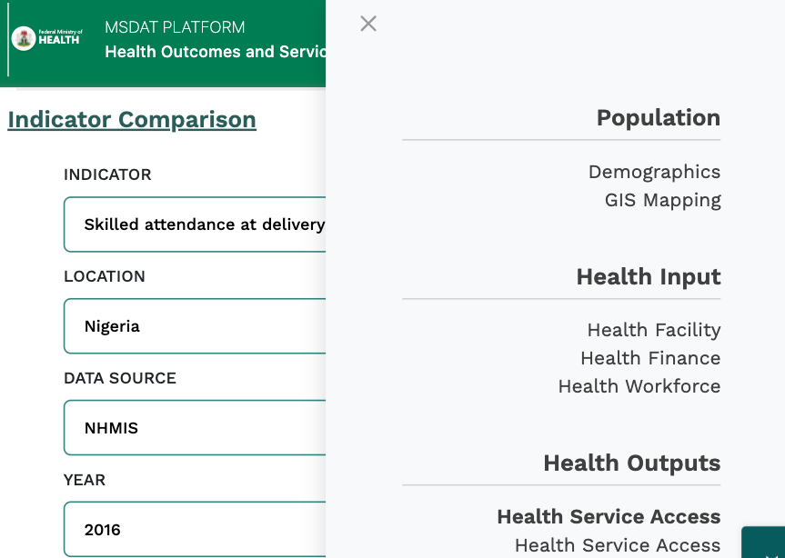
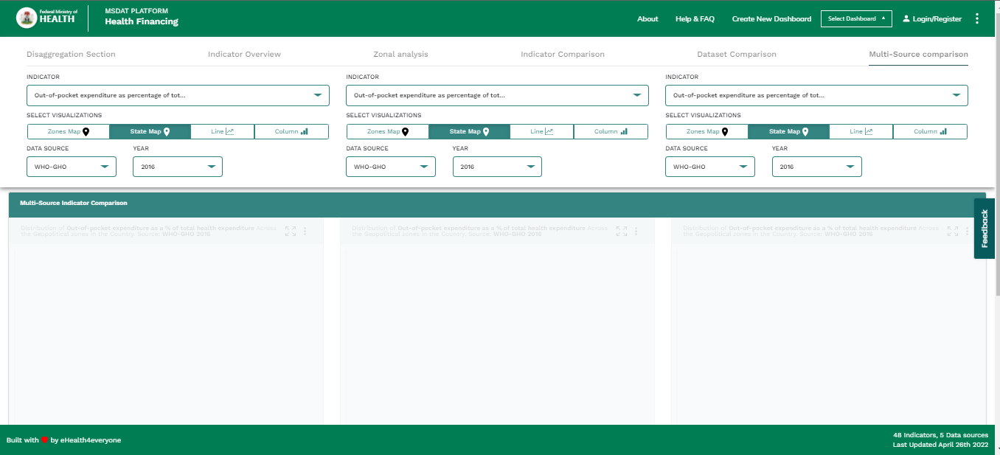
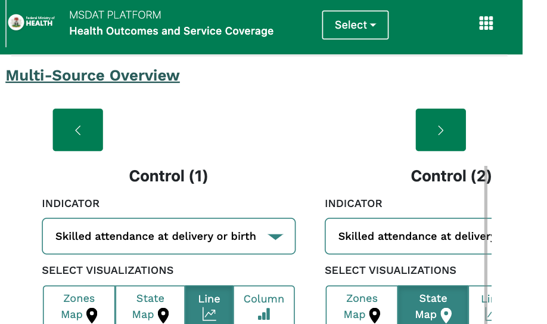
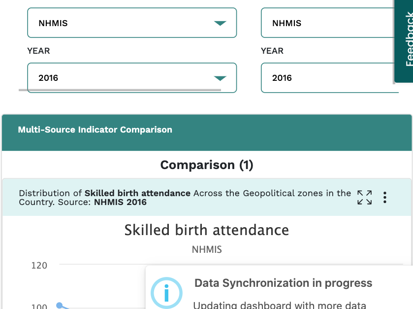

# Mobile responsiveness

## Introduction

This section outlines the changes made to the MSDAT application mobile responsiveness. Documneting the UI changes that were made with resources for changes in the codebase.

###  Desktop
Pictorial representation of the desktop header.

###  Solution for mobile

#### Top bar
For the Topbar, the changes inovolved adding and removing text and icon elements to the codebase. Elements removed include links, the drop card, Login/ Register and an icon.
Elements added include the select dropdown button and the breadcrumb icon.

Pictorial view of the dropdown select button

Pictorial view of the drawable sidebar

In addition to the changes in the topbar, sections in a row layout were converted to a columnm layouts.

<!-- ####  Removing uneccessary elements
####  Adding a dropdown tab
####  Adding a Sidebar and icon  -->

###  Multi-source section

- Challenge:
For the base panel controls and the map sections, if converted to a column layout will pose an issue to the mobile user. Control groups cannot be distinguished seperately, thus become distracting to the user.

- Solution:
The base panel control groupings were converted to a row format. To be controlled by direction buttons and scrolling triggers by the user.
The map sections were also converted to a row format that cannot be changed when scrolled by the user. The sections are only be changed when the control panel groupings are changed.

##  Codebase
For a detailed explanation of the changes made to the code base, kindly view the video documentation listed below:
https://drive.google.com/file/d/1BFV9mEf1ByHE7_CnVzizlHLONqLZ6UUU/view?usp=sharing

The mobile responsiveness includes changes made to 4 files 
- theHeader.vue
- BasePanel.vue 
- BaseDashboard.vue
- ControlPanel.vue

