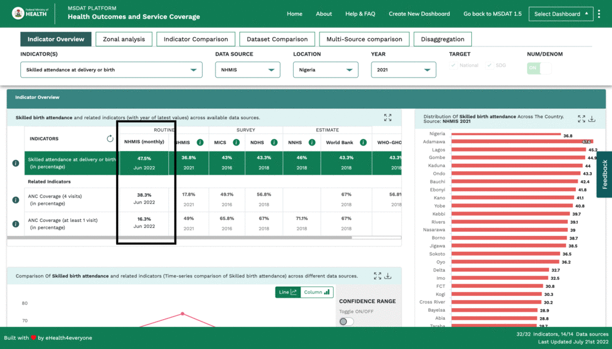

# NHMIS monthly

## Introduction
For MSDAT v2.1.1, the 'NHMIS monthly' datasource is added to the indicator overview table (solely) in the Health Outcomes subdashboard.
###  Desktop
Pictorial representation of the changes made.

## Difference
Because the datasource 'NHMIS'  should only be reflected in the indicator overview table in 'Health Outcomes'. The datasource placeholder and respective data will be added manually.

## Codebase edits
Summary: An API call is made in the mounted lifecycle hook based on the indicators on the table to get the value and year for each of the indicators present. The dats is displayed manually in the DOM.

### File edited
#### TableComponent.vue
https://gitlab.com/e4e-webdev/msdat/-/blob/develop/src/modules/msdat-dashboard/components/table/TableComponent.vue

