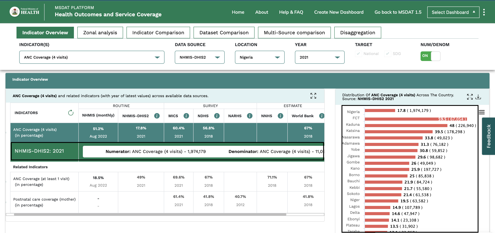
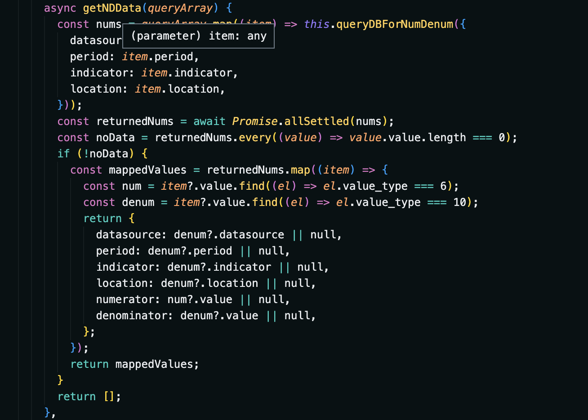
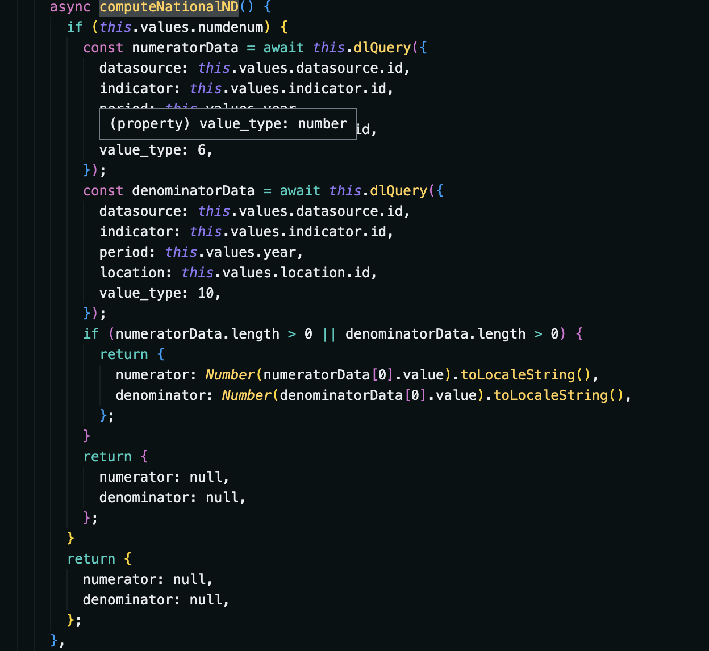
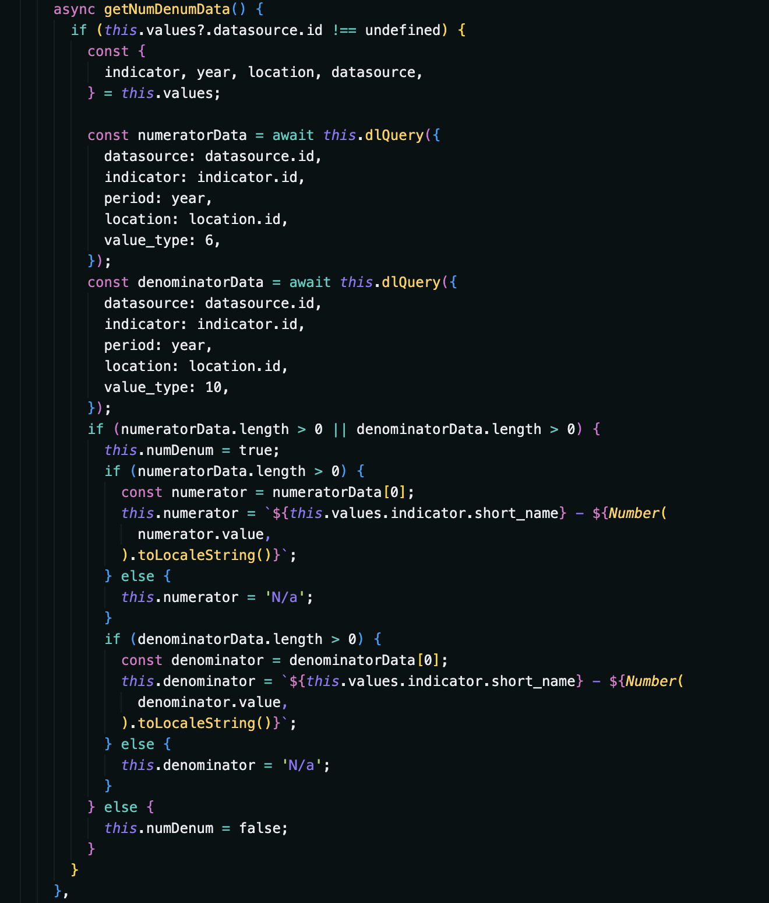

# Numerator Denominator Data

## Introduction

For MSDAT v2.1.1, the Numerator Denominator data is added as a custom row on the _table component_ and also on the _barchart component_(both on the _indicator overview section_). On the barchart section, it shows up on hover as well as on the columns(just the numerator).

This is turned off by befault and can be turned on using the toggle switch in the control panel.

###  Desktop
Pictorial representation of the changes made.

## Codebase edits
The data for this feature is gotten from dexie as others are and is specified by datatype 6 for numerator and datatype 10 for denominator. For the State bar chart, updates were made to the _updateData_ function to make room for the changes in the chart related to the feature and there's also a _computeNationalND_ function meant to get the dat but just for national(Nigeria), while the _getNDData_ function fetches the data for all states. Snippets are shown below;

Regarding the table component, when the toggle comes on, the function in the watcher trigggers a fetch for the data and the row is computed and displayed, if there's no data, the row doesn't show up. The function handling the data fetch is shown below;

### Files edited

- src/modules/msdat-dashboard/components/table/TableComponent.vue
- src/modules/msdat-dashboard/components/sections/indicator-overview/TheStateBarChart.vue
- src/modules/msdat-dashboard/mixins/formatter.js
- src/components/Barchart/defaultOption.js
- src/modules/DataLayer/mixin.js
- src/modules/DataLayer/services/database.worker.js
- src/modules/msdat-dashboard/mixins/util.js

#### Additional Info

The dexie query for this feature is differnt from what's used in most parts of the dashboard, its called _queryDBForNumDenum_ and is used in the datalayer mixin. The highcharts data object structure was also modified from 

`` [[point, value], [point, value], ... , [point, value]] ``
to 
`` [{ name: pointName, y: Number(point.value) }, { name: pointName, y: Number(point.value) }, ... , { name: pointName, y: Number(point.value) }] ``

