# Overview of Dashboard

## Introduction

The MSDAT 2.0 was developed to provide a straightforward, user friendly and functional way for performing integrated analysis, viewing and comparing key health indicators from 
different data sources. This section aims at providing a detailed explanation of the various components of MSDAT.

## Mode of Use

There are 5 core sections in the MSDAT dashboard i.e;

1.) Indicator Overview

2.) Zonal analysis

3.) Indicator Comparison

4.) Dataset Comparison 

5.) Multi-Source Comparison.

 For each section listed, a dedicated control panel is used to compare data across indicators and datasources.

#### Sub controls:
For each section, there are specific controls used; i.e

- Expand chart:

In every section,there is an expansion icon that expands the chart in view. 

Expanded Modal example:
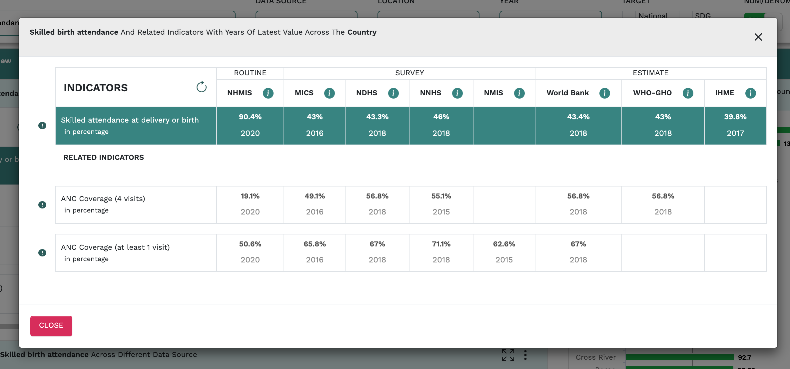

- Dropdown :

Present is each section, is a dropdown menu. This provides the functionality for data to be downloaded in different file formats.

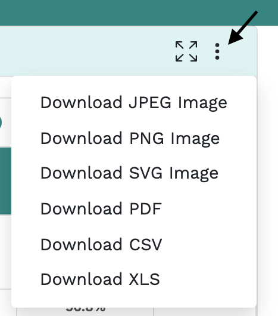

- Hovering on data points:

When each data point is hovered on all charts, a graphical representation of the data source and value is shown.
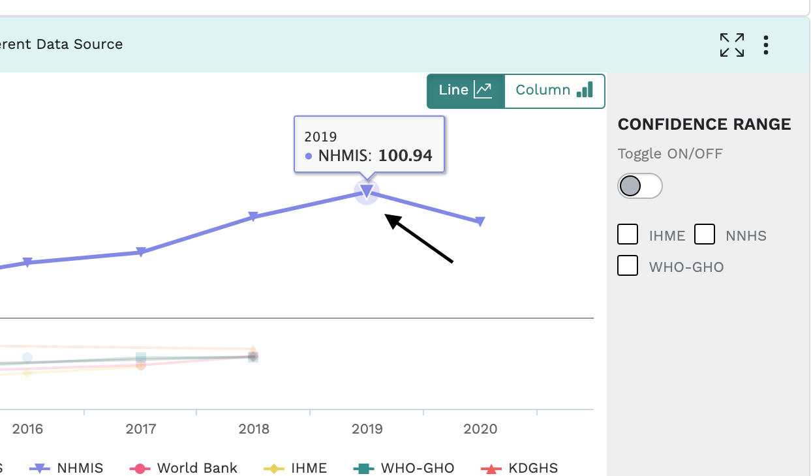

# Sections

## Indicator overview

#### Indicator overview filter:
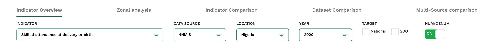

The indicator filter is a core functionality located just below the menu bar that pulls up dynamic data when prompted by the user. It comprises of 6 fields thus; INDICATOR, DATA SOURCE, LOCATION, YEAR, TARGET and NUM/DENUM.

- When a user clicks on the filter displays a drop-down menu of program areas which includes indicators classified under each of them (Program areas)
- Users can click an indicators’ program area to expand it in order to view corresponding indicators. 
- Users can also search the indicator of choice by typing indicator name in the filter bar. It comes with a predictive text function. 
- Any of the functions performed above, automatically triggers the system to display Selected indicators that will reflect on all the tabs (charts) of the dashboard.

### Sub Section (Indicator Overview)
#### Indicator table (Top left)
This table shows the values of the selected indicator (selected from the indicator filter) across data sources.The table also shows two related indicators with their values across the data sources. Data sources are classified under three categories: i) Routine, ii) National Surveys and iii) Other Estimates 

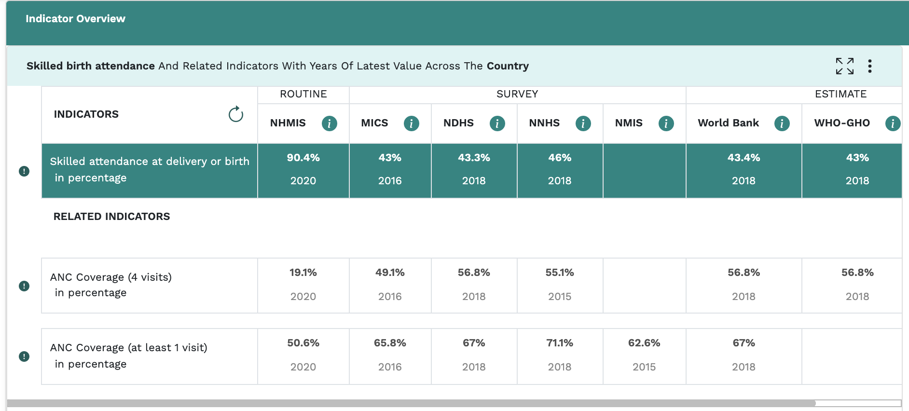

#### State chart (Right)
This chart shows indicator data for the selected indicator across the states in Nigeria. The National target line is drawn to easily identify what states fall below or above the National target.

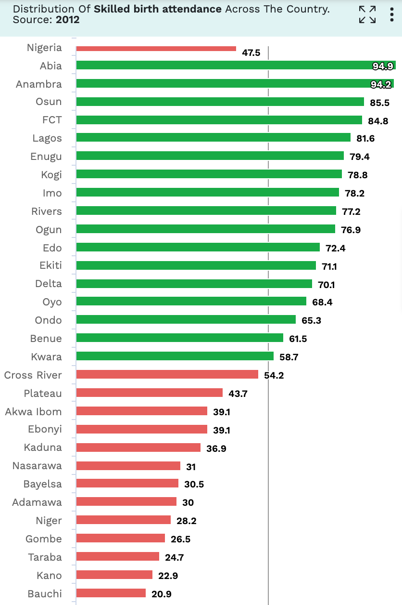

#### Trend analysis (Bottom left)
This is a chart for multiple data sources showing the trend of an indicator over time.The target line can also be seen on this chart. The data sources are differentiated by colors which can be identified using the legends displayed above the lines.

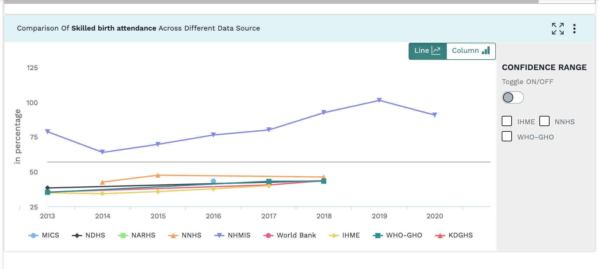

## Zonal Analysis
The Zonal analysis section is built to compare data gotten from various sources across the different states.

#### Zonal Analysis filter
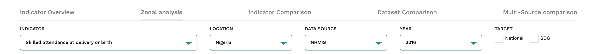

The control panel for the Zonal analysis section, comprises of 5 fields thus; 
INDICATOR, LOCATION, DATA SOURCE, YEAR and TARGET. Data displayed is filtered upon a change on any of the fields.

### Sub Section (Zonal Analysis)

#### Geopolitical zonal chart
The geopolitical zones with their states are sorted in descending order of the indicator data value; from left to right i.e. From the highest zone to the lowest zone. The legends below show what color represents a particular geopolitical zone.

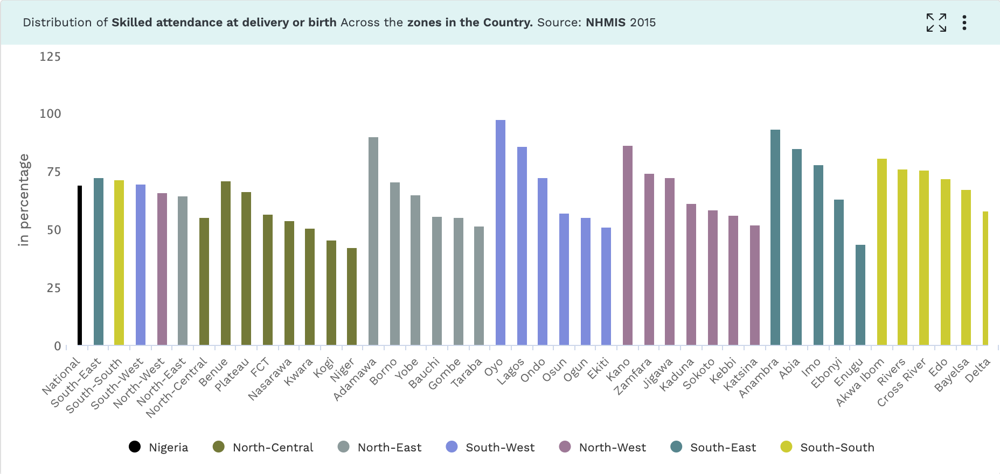

#### Thematic Map
The map is located next to the zonal chart and it helps to visualize the data from the chart according to geographical locations. Each state within a geopolitical zone is identified by a dedicated color to that zone on the map. The legends below show what color represents a state to a particular geopolitical zone.

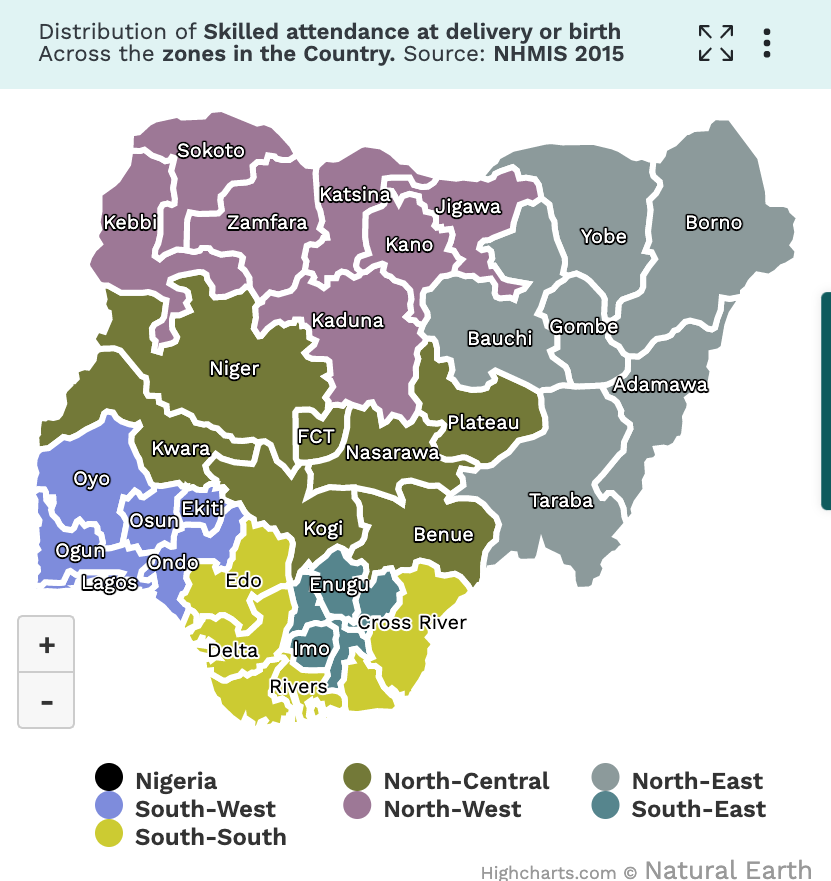

## Indicator comparison
This section is designed to allow users to compare indicator data from the different data sources across state/period. The National target line is drawn to easily identify what indicators across data sources fall below or above the National target.

#### Indicator comparison filter
The control panel for the Indicator comparison section, comprises of 5 fields thus; 
COMPARE BY, DATA SOURCE, LOCATION, INDICATOR and TARGET. Data displayed is filtered upon a change on any of the fields.

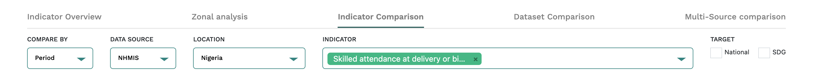

- The Compare By filter
From the drop down menu, select either to compare by ‘Period’ or ‘States’
- The datasource filter
This filter is located beside the indicator filter. In this filter you can select up to four (4) different data sources. You can also deselect previously selected data-sources by clicking on the “x” beside the data-source name.
- The Indicator filter
Navigate to the indicator filter located below the tab. From the dropdown menu, select the preferred indicator to compare.
The chart has legends at the bottom to help identify an entity on the chart.
Data sources without the indicator’s state data will only reflect the national values on the chart.

#### Outcome:
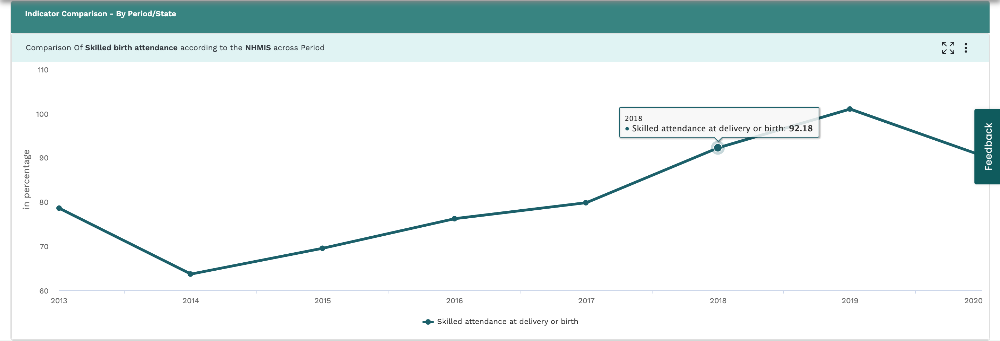

## Dataset Comparison
This section is designed to compare indicator data from the different sources across states in Nigeria.

### Dataset Comparison filter
- The Indicator filter:

The control panel for the Data comparison section, comprises of 2 fields thus; 
INDICATOR and DATA SOURCE(S). Data displayed is filtered upon a change on any of the fields.

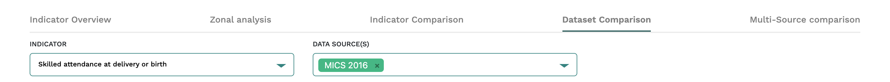

Navigate to the indicator filter located below the tab. From the dropdown menu, select the preferred indicator to compare 
The datasource filter
This filter is located beside the indicator filter. In this filter you can select up to four (4) different data sources. You can also deselect previously selected data-sources by clicking on the “x” beside the data-source name.
  
The chart has legends at the bottom to help identify an entity on the chart.

Data sources without the indicator’s state data will only reflect the national values on the chart.

#### Outcome:
Comparison across different data sources by states
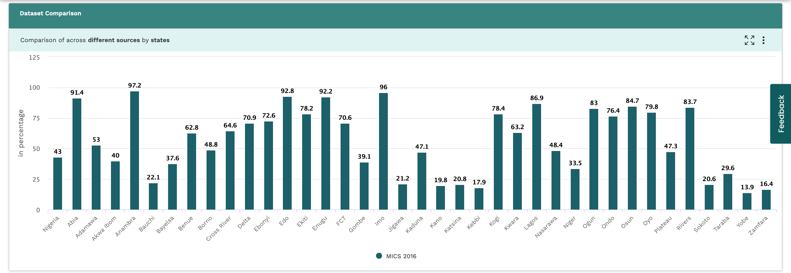

## Multi source Indicator comparison
This tab allows to compare and analyze the data of up to three indicators. 

#### Multi source Indicator comparison filter
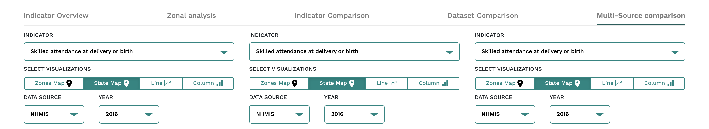

By default, the selected indicator and two related indicators are shown on the charts.
- Each chart has 4 visualizations accessible at the top of each  to aid comparisons between 3 different indicator data sets.
- Each chart can be expanded for a clearer view by clicking on the “Expand” button located on the top left corner of each chart in the tab.
- On the map visualisations, you can zoom in and out by clicking on the “+” and “-” icons respectively, located on the left top corner of the map.

The 4 fields for each section includes; INDICATOR, SELECT VISUALIZATIONS, DATA SOURCE and YEAR. Upon any change of the input fields, it directly affects the data shown in for the Multi source Indicator comparison section.

#### Outcome:
Comparison across different indicators/ data source/ year in 3 different sections.
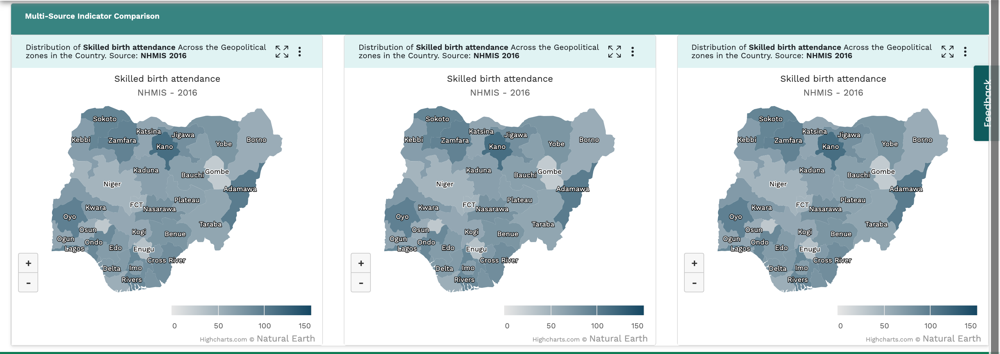

- To change Indicator for each chart:
Click the indicator filter for the chart and select the desired indicator.
- To change the mode of visualization
Navigate to the visualization bar below the indicator drop down. From the menu, select the preferred visualization mode (Zones map, States Map, Line, Column)
- To change datasource for each chart:
Click the datasource filter and select the preferred datasource.
- To change Period (Year) for each chart:
Click the period filter and select the year of interest.

