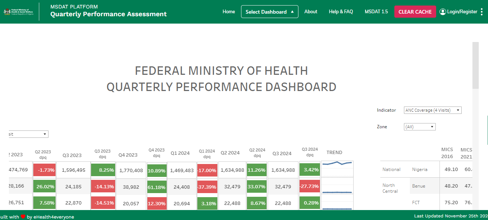

# Quaterly Performance Dashboard

## Introduction

The Quaterly Performance Dashboard is a tool that provides a straightforward, user friendly and functional way for performing integrated analysis, viewing and comparing key health indicators from different data sources. This section aims at providing a detailed explanation of the various components of the Quaterly Performance Dashboard.

## Desktop

pictoral respresetation of the desktop view of the Quaterly Performance Dashboard

## Code base

This dashboard was built using Tableau and the it was directly embedded into the main application page. 