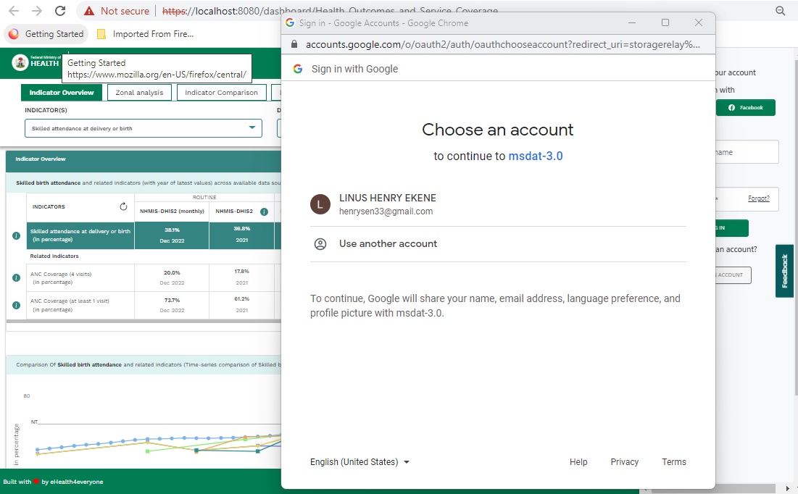

# Social Authentication

## Introduction

The MSDAT Social Authentication gives user the opportunity to login and signup using a preferd social media credentials. The user must already have an account with the social media or will have to create an account for this to be possible
available implimented social authentication:

- Google
- Facebook

## Process Flow

When a user clicks the designated button ( for google or facebook) a popup appears. If there is an account logged in on the system at the point of authentication it is displayed on the popup. The user then select the accout with which him / her wish to login or signup with. This takes some seconds depending on the network but if all things goes well the user is login or signup as the case maybe.

## possible error

When a user signup with google with an email admin@gmail.com, then later comes on the platform an tries to either signup / login with facebook which also has an email admin@gmail.com, this throws an error since the email property is unique. The error tells the user to login with the appropiate social media already registered with the platform

## Json Response

- username / email
- avatar
- token
- assessToken
- refreshToken

## Affected files

- Auth/config/facebook.js
- Auth/store
- msdat-dashboard/views/about/components/login.vue
- msdat-dashboard/views/about/layout/theHeader.vue
- main.ts
- .env

## Added Package

- vue-google-oauth2

## Important Variables

- VUE_GOOGLE_CLIENT_ID
- VUE_APP_FACEBOOK_APP_ID
