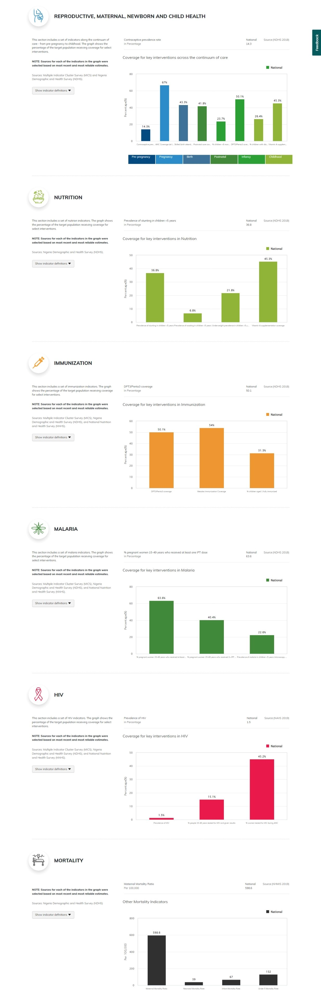

# State Profile

> This page holds explanation for files in the State-Profile Dashboard
> The *landData.js* file holds static data regarding land area info for all states (land area and position) including the FCT and Nigeria.

## Files in this folder

The Root Folder
: This holds the vuex store file for the module (*store.js*), the *requests.js* file, which holds the API calls needed, extracted to that file for easy maintainability, the router file (*router.js*) and the main *index.js* file which exports this logic. We also have the *components* and *views* folders.

> The *landData.js* file holds static data regarding land area info for all states (land area and position) including the FCT and Nigeria.

### Intro js

> This is the *intro.vue* file in the *views* folder. It uses the generic *basemap* component used across the codebase to display the map as seen above and allow the user to select whatever state by clicking on it.

### Main Page

> This has three main sections, namely;
1. Demographics
2. Program Area Overview
3. Health Services

### Demographics

> This is found in the *demographics.vue* file in the components folder and also uses the generic *basemap* component as well as the *DataSourceMetaDataModal*.

> All API Requests are imported from the *requests* file while the land area data is imported from the *landdata.js* file in the same directory (These are statically populated values for land area info for all states including Nigeria).

---

> When the component is mounted, it makes API calls to get the data sources then calls *prepareDemographicData* (to get the demographic values based on the chosen location then the *setLandAreaData* to actually extract and set the values gotten) and also calls *setLandAreaData*. 

> The component watches for changes in the user selected location so as to call *prepareDemographicData* and *setLandAreaData* dynamically.

## Program Area Overview

> This is found in the *programAreaOverview.vue* file in the components folder and uses the generic *BaseBar* component as well as the API requests gotten from *requests*.

> This component displays one program area eg, Mortality. The parent component, *stateProfile.vue* loops through all the program areas feeds the individual data as props to this component.

> When mounted, it gets indicators and sources from *getIndicatorsAndSources* method then based on the location, it fetches the required data then plots the chart using *justNationalData* or *prepareStateAndNationalData*. During the process of data fetching, it emits an event (*overviewLoading*) to the parent component so it displays the loader.

> List of props needed in this component include;
- State (User Selected Location)
- Locations (List of Location gotten from the parent component)
- ProgramArea (The program area in focus)
- Indicator Definintions

## Health Services

> This is found in the *programAreaOverview.vue* file in the components folder and uses the API requests gotten from *requests*.

> Along with the Program Area Overview, when the component is mounted, the health facility data is reset then the new data is updated.

## API Requests

> The API requests utilized in the dashboard are stored in the *requests.js* file and exported. It imports axiosInstance as well as well as the endpoints needed.

> The methods being exported are;
1. allLocations (To get all locations)
2. latestData (To get the date of the latest data)
3. datasourceSpecific
4. fetchDemographics (For demographics)
5. getRegularData (For Program overview and health services data)
6. getIndicatorsAndSources (Fetches both list of indicators and list of data sources)

