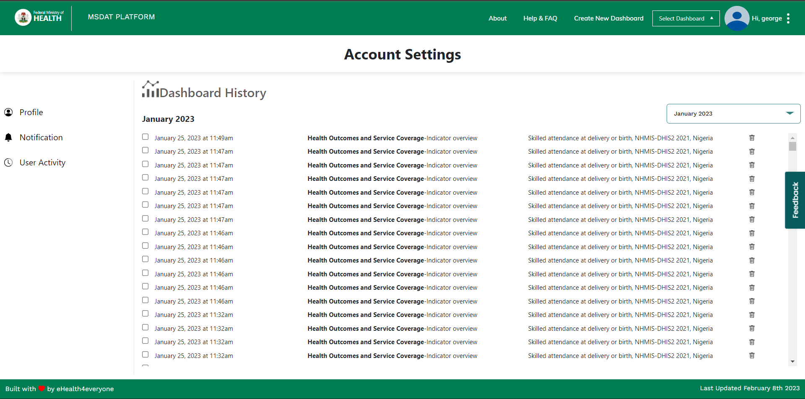

# User activity Log

## Introduction

The MSDAT User activity log helps track a user's interactions across the various MSDAT dashboards. It tracks user interaction based on certain parameters listed below:
- The dashboard the user is on
- The section the user is on
- Selected Indicator
- Selected Datasource
- Selected Location
- Selected Year

The user activity log is accessible on the User activity page on the View account Dropcard




## Process Flow

Each User interaction is stored in a cookie. When the amount of user interaction reaches 10, the user interactions are sent to the API endpoint to be retrieved on the user activity page  in descending order. It also saves interactions to the cookie if user internet connection is detected to be offline and makes a post request when the user comes back online and user activity is above 9

### Key Functions
 This function is used to get the user interactions on the Dashboard and sent to the cookie. it also makes a post request to the endpoint through store ACTIONS when interactions exceed 9
```js
async setInteractions() {
      const getFormattedConfig = VueCookies.get('customDashboardConfig');
      const { data } = await apiServices.getDashboard();
      this.dashboard = data.results.find((item) => item.title === this.$route.meta.title);
      const dashboardName = this.dashboard?.id || getFormattedConfig?.name;

      const interaction = {
        year: this.payload.year,
        user: this.getUser.id,
        dashboard: dashboardName,
        section: this.controlIndex + 1,
        indicator: this.payload.indicator.id,
        datasource: this.payload.datasource.id,
        location: this.payload.location.id,
        viewed_at: moment().format(),
      };
      this.interactions.push(interaction);
      if (this.isAuthenticated === true) {
        VueCookies.set('user_interactions', JSON.stringify(this.interactions));
        const interactions = JSON.parse(VueCookies.get('user_interactions'));
        console.log('test', interactions);
        if (interactions.length > 9 && this.getInternetStatus === true) {
          interactions.forEach(async (el) => {
            await this.SET_INTERACTIONS(el);
          });
          this.interactions = [];
        }
        // }
      }
    },
```

This are the store actions that are used to set, get and Delete user interactions from the endpoint
```js
export default {
  async SET_INTERACTIONS({ commit }, payload) {
    try {
      const { data } = await axiosInstance.post('/user_interactions/', payload);
      commit('setInteraction', data);
    } catch (error) {
      console.log(error);
    }
  },
  async GET_INTERACTIONS({ commit }, payload) {
    try {
      const response = await axiosInstance.get(`/user_interactions/?user=${payload}&size=10000`);
      const { results } = response.data;
      commit('setInteractions', results);
    } catch (error) {
      console.log(error);
    }
  },
  async DELETE_INTERACTION({ commit }, payload) {
    try {
      const response = await axiosInstance.delete(`/user_interactions/${payload}/`);
      commit('set_success', response);
    } catch (error) {
      console.log(error);
    }
  },
  setInternetStatus({ commit }, payload) {
    commit('setInternetStatus', payload);
  },
};

```